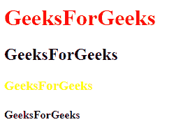
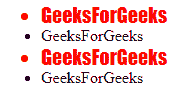

# 带示例的 jQuery | eq()

> 原文:[https://www.geeksforgeeks.org/jquery-eq-with-examples/](https://www.geeksforgeeks.org/jquery-eq-with-examples/)

jQuery 是一个非常强大的工具，它可以帮助我们结合多种 DOM 遍历方法，随机或按顺序选择文档中的元素。大多数 DOM 遍历方法不修改元素，否则它们会根据给定的条件过滤掉元素。
**eq()方法**是 jQuery 中的一种内置方法，用于直接定位所选元素，并返回具有特定索引的元素。
**语法:**

```html
$(selector).eq(index)
```

**参数:**这里参数“index”指定元素的索引。
可以是正数，也可以是负数。
T4【注:

*   索引号总是从 0 开始，所以第一个数字的索引是 0(不是 1)。
*   使用负数作为索引会从列表末尾开始索引计数。

<center>**jQuery code to show the working of the eq() method:**</center>

**Code #1:**
Below code will select the specified elements.

```html
<html>

<head>
    <title>GeeksForGeeks articles</title>
    <script src="https://ajax.googleapis.com/ajax/libs/
                 jquery/3.3.1/jquery.min.js"></script>
    <script type="text/javascript">
        $(document).ready(function() {
            $(".heading").eq(0).css("color", "red");
            $(".heading").eq(2).css("color", "yellow");
        });
    </script>
</head>

<body>
    <h1 class="heading">GeeksForGeeks</h1>
    <h2 class="heading">GeeksForGeeks</h2>
    <h3 class="heading">GeeksForGeeks</h3>
    <h4 class="heading">GeeksForGeeks</h4>
</body>

</html>
```

**输出:**

**代码#2:**
下面的代码会选择指定的负指数元素。

```html
<html>

<head>
    <title>GeeksForGeeks articles</title>
    <script src="https://ajax.googleapis.com/ajax/
                 libs/jquery/3.3.1/jquery.min.js"></script>

    <script type="text/javascript">
        $(document).ready(function() {
            $(".heading").eq(-2).addClass("style");
            $(".heading").eq(-4).addClass("style");

        });
    </script>
    <style>
        .style {
            color: red;
            font-family: fantasy;
            font-size: 20px;
        }
    </style>
</head>

<body>
    <ul>
        <li class="heading">GeeksForGeeks</li>
        <li class="heading">GeeksForGeeks</li>
        <li class="heading">GeeksForGeeks</li>
        <li class="heading">GeeksForGeeks</li>
    </ul>
</body>

</html>
```

**输出:**


**jQuery : eq() vs get()**

*   。eq()将其作为 jQuery 对象返回，这意味着 DOM 元素被包装在 jQuery 包装器中，这意味着它接受 jQuery 函数。
*   。get()返回一个原始 DOM 元素的数组。