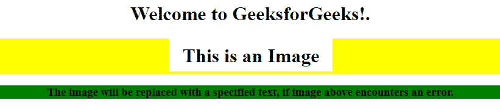
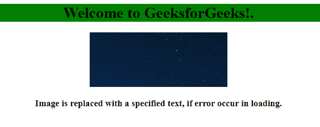

# jQuery | error()方法

> 原文:[https://www.geeksforgeeks.org/jquery-error-method/](https://www.geeksforgeeks.org/jquery-error-method/)

jQuery 中的 **error()方法**用于当一个元素遇到一个错误，即元素没有被正确加载时。**错误()方法**在错误事件发生或触发错误事件时附加一个要运行的函数。

**语法:**

*   **在错误事件中增加功能:**

    ```
    $(selector).error(function)
    ```

*   **某些选定元素触发错误事件:**

    ```
    $(selector).error()
    ```

**参数:**

*   **功能:**此参数为可选参数，它指定了错误事件发生时要运行的功能。

**示例-1:**

```
<!DOCTYPE html>
<html>

<head>
    <title>error() method</title>
    <script src=
"https://ajax.googleapis.com/ajax/libs/jquery/3.3.1/jquery.min.js">
  </script>

  <script>
        $(document).ready(function() {
            $("img").error(function() {
                $("img").replaceWith(
                  "<h3>Error occurs</h3>");
            });
        });
    </script>
</head>

<body>
    <center>

        <h1>Welcome to GeeksforGeeks!.</h1>
        <div style="background-color:yellow;">
        
      </div>
        <div style="background-color:green">

        <h3> The image will be replaced with specified
       text if the image above encounters an error.</h3>

        </div>
    </center>

</body>

</html>
```

**输出:**


**示例-2:**

```
<!DOCTYPE html>
<html>

<head>
    <title>error() method</title>
    <script src=
"https://ajax.googleapis.com/ajax/libs/jquery/3.3.1/jquery.min.js">
  </script>
    <script>
        $(document).ready(function() {
            $("img").error(function() {
              $("img").replaceWith(
               "<h3>Error </h3>");
            });
        });
    </script>
</head>

<body>
    <center>
        <div style="background-color:green">
            <h1>Welcome to GeeksforGeeks!.
          </h1>
        </div>
        

      <h3>Image is replaced with a specified 
        text, if error occur in loading.</h3>

    </center>

</body>

</html>
```

**输出:**


**注意:** *这个方法在 jQuery 版本*中被移除。