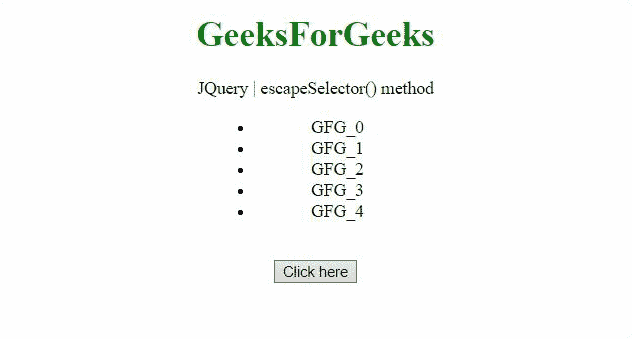
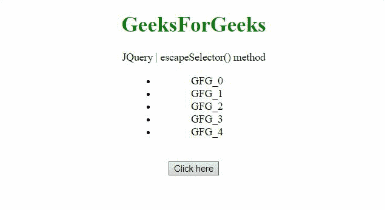

# JQuery 擒纵选择器()方法

> 原文:[https://www.geeksforgeeks.org/jquery-escapeselector-method/](https://www.geeksforgeeks.org/jquery-escapeselector-method/)

jQuery 中的**转义选择器()方法**用于转义具有特殊有效字符或字符串的 CSS 选择器。它可以选择 id 的元素(' #ID1 '，' #ID2 ')和 class 的元素(' . class1 '，' . class2 ')。让我们借助几个例子来理解它。

**语法:**

```
jQuery.escapeSelector( selector )
```

**参数:**该方法接受单参数**选择器**，该选择器保存包含要转义的选择器表达式的字符串(例如' #ID1 '等)。

**示例 1:** 本示例选择 *class = '的元素。列表'*。

```
<!DOCTYPE HTML>
<html>

<head>
    <title>
        jQuery escapeSelector() method
    </title>

    <script src=
"https://code.jquery.com/jquery-3.5.0.js">
    </script>

    <style>
        li {
            width: 150px;
            margin: 0 auto;
        }

        .highlight {
            background-color: green;
        }
    </style>
</head>

<body style="text-align:center;">

    <h1 style="color:green;">
        GeeksForGeeks
    </h1>

    <p id="GFG_UP"></p>

    <ul>
        <li class=".list">GFG_0</li>
        <li class=".list">GFG_1</li>
        <li class="list">GFG_2</li>
        <li class="list">GFG_3</li>
        <li class=".list">GFG_4</li>
    </ul>
    <br>

    <button onclick="Geeks()">
        Click here
    </button>

    <p id="GFG_DOWN"></p>

    <script>
        var elUp = document.getElementById("GFG_UP");
        var elDown = document.getElementById("GFG_DOWN");

        elUp.innerHTML = 
            "JQuery | escapeSelector() method";

        function Geeks() {
            $("ul").find("." + $.escapeSelector(
                        ".list")).addClass("highlight");

            elDown.innerHTML = "The list elements of class"
                    + " '.list' are highlighted not the "
                    + "elements of class 'list'";
        } 
    </script>
</body>

</html>
```

**输出:**


**示例 2:** 本示例选择 *ID = '#list'* 的元素。

```
<!DOCTYPE HTML>
<html>

<head>
    <title>
        jQuery escapeSelector() method
    </title>

    <script src=
"https://code.jquery.com/jquery-3.5.0.js">
    </script>

    <style>
        li {
            width: 150px;
            margin: 0 auto;
        }

        .highlight {
            background-color: green;
        }
    </style>
</head>

<body style="text-align:center;">

    <h1 style="color:green;">
        GeeksForGeeks
    </h1>

    <p id="GFG_UP"></p>

    <ul>
        <li id="#list">GFG_0</li>
        <li>GFG_1</li>
        <li>GFG_2</li>
        <li>GFG_3</li>
        <li id="list">GFG_4</li>
    </ul>
    <br>

    <button onclick="Geeks()">
        Click here
    </button>

    <p id="GFG_DOWN"></p>

    <script>
        var elUp = document.getElementById("GFG_UP");
        var elDown = document.getElementById("GFG_DOWN");
        elUp.innerHTML = 
            "JQuery | escapeSelector() method";

        function Geeks() {
            $("ul").find("#" + $.escapeSelector(
                    "#list")).addClass("highlight");

            elDown.innerHTML = "The list element of id"
                    + " '#list' is highlighted not the"
                    + " element of id 'list'";
        } 
    </script>
</body>

</html>
```

**输出:**
