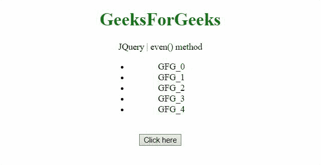
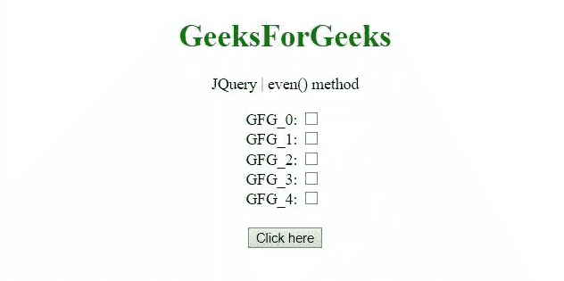

# jQuery 连()法

> 原文:[https://www.geeksforgeeks.org/jquery-even-method/](https://www.geeksforgeeks.org/jquery-even-method/)

jQuery 中的**偶()**方法用于从所选元素中选择偶索引元素。

**语法:**

```html
$(selector).even()

```

**返回值:**返回偶数索引元素。

**示例 1:** 本示例选择偶数索引列表元素。

```html
<!DOCTYPE HTML>
<html>

<head>
    <title>
        jQuery even() method
    </title>

    <script src=
"https://code.jquery.com/jquery-3.5.0.js">
    </script>

    <style>
        li {
            width: 150px;
            margin: 0 auto;
        }

        .highlight {
            background-color: green;
        }
    </style>
</head>

<body style="text-align:center;">

    <h1 style="color:green;">
        GeeksForGeeks
    </h1>

    <p id="GFG_UP"></p>
    <ul>
        <li>GFG_0</li>
        <li>GFG_1</li>
        <li>GFG_2</li>
        <li>GFG_3</li>
        <li>GFG_4</li>
    </ul>
    <br>

    <button onclick="Geeks()">
        Click here
    </button>

    <p id="GFG_DOWN"></p>

    <script>
        var elUp = document.getElementById("GFG_UP");
        var elDown = document.getElementById("GFG_DOWN");
        elUp.innerHTML = "JQuery | even() method";

        function Geeks() {
            $("ul li").even().addClass("highlight");
            elDown.innerHTML = 
                "The even elements are highlighted";
        } 
    </script>
</body>

</html>
```

**输出:**


**示例 2:** 本示例选中了偶数索引复选框。

```html
<!DOCTYPE HTML>
<html>

<head>
    <title>
        jQuery even() method
    </title>

    <script src=
"https://code.jquery.com/jquery-3.5.0.js">
    </script>
</head>

<body style="text-align:center;">
    <h1 style="color:green;">
        GeeksForGeeks
    </h1>

    <p id="GFG_UP"></p>

    GFG_0: <input type="checkbox" 
        id="GFG_0" value="GFG_0"><br>

    GFG_1: <input type="checkbox" 
        id="GFG_1" value="GFG_1"><br>

    GFG_2: <input type="checkbox" 
        id="GFG_2" value="GFG_2"><br>

    GFG_3: <input type="checkbox" 
        id="GFG_3" value="GFG_3"><br>

    GFG_4: <input type="checkbox" 
        id="GFG_4" value="GFG_4">
    <br><br>

    <button onclick="Geeks()">
        Click here
    </button>

    <p id="GFG_DOWN"></p>

    <script>
        var elUp = document.getElementById("GFG_UP");
        var elDown = document.getElementById("GFG_DOWN");
        elUp.innerHTML = "JQuery | even() method";

        function Geeks() {
            $("input").even().attr("checked", true);
            elDown.innerHTML = 
                "The even elements are checked";
        } 
    </script>
</body>

</html>
```

**输出:**
