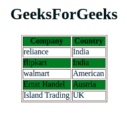
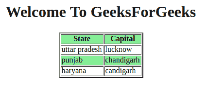

# jQuery |:偶数选择器

> 原文:[https://www.geeksforgeeks.org/jquery-even-selector/](https://www.geeksforgeeks.org/jquery-even-selector/)

**jQuery:偶数选择器**用于从元素中选择偶数索引。索引号从 0 开始。工作原理与**相同:奇数**选择器，但偶数选择器。
**语法**

```
$(":even")
```

**示例-1:**

## 超文本标记语言

```
<!DOCTYPE html>
<html>

<head>
    <script src=
"https://ajax.googleapis.com/ajax/libs/jquery/3.3.1/jquery.min.js">
  </script>

  <script>
        $(document).ready(function() {
            $("tr:even").css("background-color",
                            "green");
        });
    </script>
</head>

<body>

    <center>
        <h1>GeeksForGeeks</h1>

        <table border="1">
            <tr>
                <th>Company</th>
                <th>Country</th>
            </tr>
            <tr>
                <td>reliance</td>
                <td>India</td>
            </tr>
            <tr>
                <td>flipkart</td>
                <td>India</td>
            </tr>
            <tr>
                <td>walmart</td>
                <td>American</td>
            </tr>
            <tr>
                <td>Ernst Handle</td>
                <td>Austria</td>
            </tr>
            <tr>
                <td>Island Trading</td>
                <td>UK</td>
            </tr>
        </table>
    </center>

</body>

</html>
```

**输出:**



**示例-2:**

## 超文本标记语言

```
<!DOCTYPE html>
<html>

<head>
    <script src=
"https://ajax.googleapis.com/ajax/libs/jquery/3.3.1/jquery.min.js">
  </script>

  <script>
    $(document).ready(function() {
       $("tr:even").css("background-color",
                    "lightgreen");
        });
    </script>
</head>

<body>

    <center>
        <h1>Welcome To GeeksForGeeks
      </h1>

        <table border="2">
            <tr>
                <th>State</th>
                <th>Capital</th>
            </tr>
            <tr>
                <td>uttar pradesh</td>
                <td>lucknow</td>
            </tr>
            <tr>
                <td>punjab</td>
                <td>chandigarh</td>
            </tr>
            <tr>
                <td>haryana</td>
                <td>candigarh</td>
            </tr>
        </table>
    </center>

</body>

</html>
```

**输出:**



**支持的浏览器:**

*   谷歌 Chrome 90.0+
*   Internet Explorer 9.0
*   Firefox 3.6
*   Safari 4.0
*   歌剧 10.5