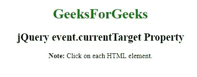
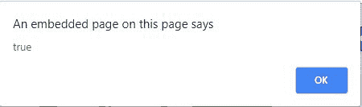
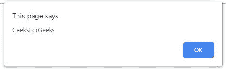

# jQuery | event.currentTarget 属性

> 原文:[https://www . geesforgeks . org/jquery-event-current target-property/](https://www.geeksforgeeks.org/jquery-event-currenttarget-property/)

jQuery 中的**事件. currentTarget 属性**用于在*事件冒泡阶段*内*返回当前 DOM 元素*。
事件电流目标通常等于**“这个”**。

**语法:**

```
event.currentTarget
```

**参数:**

*   **事件:**为必输参数，该参数来自事件绑定函数。

**示例-1:**

```
<!DOCTYPE html>
<html>

<head>
    <title>
      jQuery event.currentTarget Property
  </title>
    <script src=
"https://ajax.googleapis.com/ajax/libs/jquery/3.3.1/jquery.min.js">
  </script>

  <script>
        $(document).ready(function() {
          $("h1, h2, p").click(function(event) {
             alert(event.currentTarget === this);
            });
        });
    </script>
</head>

<body>
    <center>
        <h1 id="geeks1" style="color:green;">
          GeeksForGeeks
      </h1>
        <h2 id="geeks2">
          jQuery event.currentTarget Property
      </h2>
        <p>
          <b>Note:</b> Click on each HTML element.
      </p>
    </center>
</body>

</html>
```

**输出:**

**点击前:**


**点击任意元素后:**


**示例-2:**

```
<!DOCTYPE html>
<html>

<head>
    <title>
      jQuery event.currentTarget Property
  </title>

    <script src=
"https://ajax.googleapis.com/ajax/libs/jquery/3.3.1/jquery.min.js">
  </script>

  <script>
        $(document).ready(function() {
         $("h1, p").click(function(event) {
             alert(event.currentTarget.innerHTML);
            });
        });
    </script>
</head>

<body>
    <center>
        <h1 id="geeks1" 
            style="color:green;">
          GeeksForGeeks
      </h1>
        <h2 id="geeks2">
          jQuery event.currentTarget Property
      </h2>
        <p>
        <b>Note:</b> Click on each HTML element.
      </p>
    </center>
</body>

</html>
```

**输出:**

**点击前:**


**点击极客后的头像:**
