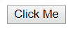
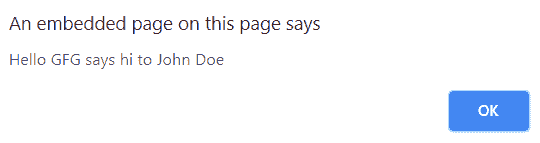
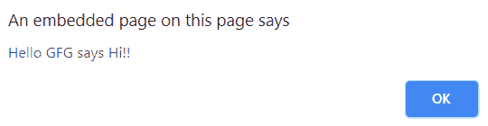
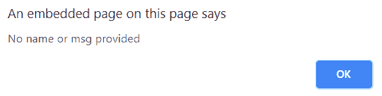

# jQuery | event.data 属性

> 原文:[https://www.geeksforgeeks.org/jquery-event-data-property/](https://www.geeksforgeeks.org/jquery-event-data-property/)

event.data 属性用于包含传递给事件方法的可选数据。当前执行的处理程序绑定时传递的数据。

**语法:**

```html
event.data
```

**参数:**

*   **事件:**是用于在选择器上指定事件类型名称的参数。

**返回值:**该方法返回一个对象。

**示例:**下面的示例说明了 jQuery 中的 event.data 方法:

```html
<!DOCTYPE html>
<html>

<head>
    <title>The event.data property</title>
    <script src=
"https://code.jquery.com/jquery-3.3.1.js">
  </script>

    <script type="text/javascript">
        $(document).ready(function() {
            $('#ClickMe').on('click', {
                msg: 'GFG says hi to',
                name: 'John Doe'
            }, sayHello);

            $('#ClickMe').on('click', {
                msg: 'GFG says Hi!!'
            }, sayHello);

            $('#ClickMe').on('click', sayHello);

            function sayHello(event) {
                if (event.data == null) {
                    alert('No name or msg provided');
                } else {
                    alert('Hello ' + event.data.msg +
                        (event.data.name != null ? ' ' 
                         + event.data.name : ''));
                }
            }
        });
    </script>
</head>

<body style="font-family:Arial">
    <input id="ClickMe" type="button" value="Click Me" />
</body>

</html>
```

**输出:**
**点击前:**


**点击第一个提醒框后:**


**点击第二个提醒框后:**


**点击第三个提醒框后:**
