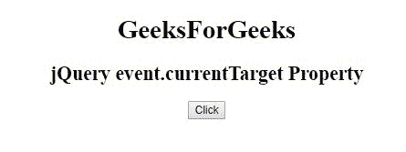
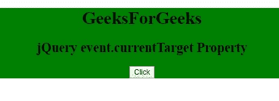

# jQuery | event.delegateTarget 属性

> 原文:[https://www . geeksforgeeks . org/jquery-event-delegatetarget-property/](https://www.geeksforgeeks.org/jquery-event-delegatetarget-property/)

jQuery 中的 **event.delegateTarget 属性**用于*返回*元素，当前称为**的 jQuery 事件处理程序**被附加到该元素中。

**语法:**

```html
event.delegateTarget
```

**参数:**

*   **事件**:必选参数，该事件参数来自事件绑定功能。

**示例:**

```html
<!DOCTYPE html>
<html>

<head>
    <title>
      jQuery event.currentTarget Property
  </title>
    <script src=
"https://ajax.googleapis.com/ajax/libs/jquery/3.3.1/jquery.min.js">
  </script>

  <script>
        $(document).ready(function() {
            $("div").on("click", "button",
                        function(event) {
                $(event.delegateTarget).css(
                  "background-color", "green");
            });
        });
    </script>
</head>

<body>
    <center>
        <div>
            <h1>GeeksForGeeks</h1>
            <h2 id="geeks2">
              jQuery event.currentTarget Property
          </h2>
            <button>Click</button>
        </div>
    </center>
</body>

</html>
```

**输出:**

**点击前:**


**点击后:**
