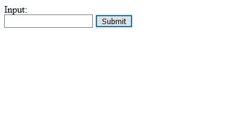
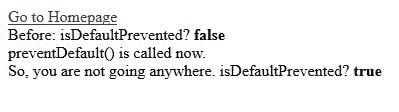

# jQuery | event . isdefaultprevented()方法

> 原文:[https://www . geesforgeks . org/jquery-event-isdefaultprevented-method/](https://www.geeksforgeeks.org/jquery-event-isdefaultprevented-method/)

**是 DefaultPrevented()方法**是 jQuery 中的一个内置方法，它检查是否为事件调用了 preventDefault()方法。此方法返回一个布尔值。如果对事件调用了 preventDefault()，则返回 True，否则返回 False。

**语法:**

```
event.isDefaultPrevented()
```

**参数:**接受来自事件绑定功能的单参数**事件**。

**返回值:**如果事件上调用了 preventDefault()函数，则返回 True，否则返回 false。

**示例-1:** 本示例检查是否在事件上调用了 isPreventDefault()方法。

```
<!doctype html>
<html>

<head>
    <title>
        isPreventDefault() Method
    </title>

    <script src=
        "https://code.jquery.com/jquery-3.3.1.min.js">
    </script>
</head>

<body>
    <a href="https://www.geeksforgeeks.org">
        Go to Homepage
    </a>

    <div id="initial"></div>
    <div id="prevented"></div>
    <div id="response"></div>

    <!-- Script to check preventDefault() Method called or not -->
    <script>
        $( "a" ).click(function( event ) {

            $( "#initial" ).html( "Before: isDefaultPrevented? <strong>"
                    +event.isDefaultPrevented()+"</strong>");

            event.preventDefault();

            $( "#prevented" ).html( "preventDefault() is called now.");

            $( "#response" ).html( "So, you are not going anywhere."
                    + " isDefaultPrevented? <strong>"
                    + event.isDefaultPrevented() + "</strong>");
        });
    </script>
</body>

</html>                    
```

**输出:**
**点击链接前:**

**点击链接后:**


**注:**黑体文字**(真/假)**为 **isDefaultPrevented()** 法的值。

**示例 2:** 本示例检查 isDefaultPrevented()方法是否阻止默认操作。

```
<!doctype html>
<html>

<head>
    <title>
        isPreventDefault() Method
    </title>
    <script src=
        "https://code.jquery.com/jquery-3.3.1.min.js">
    </script>
</head>

<body>

    <form action = "action.php">
        Input:<br>
        <input type="text" name="input_1">

        <button type="submit">Submit</button>

    </form> 

    <!-- Script to describe isDefaultPrevented() Method -->
    <script>
        $( "button" ).click(function( event ) {
            if(event.isDefaultPrevented())
                alert('Default action was prevented');
            else
                alert('Click Ok');

            event.preventDefault();

            if(event.isDefaultPrevented())
                alert('Default action was prevented');
            else
                alert('Click Ok');
        });
    </script>
</body>

</html>                    
```

**输出:**
**点击提交按钮前:**

**点击提交按钮后:**

**以上步骤后默认事件阻止:**
