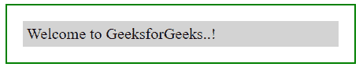
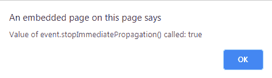
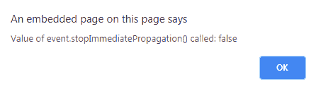

# jQuery | event . isimmediatepropationstop()方法

> 原文:[https://www . geeksforgeeks . org/jquery-event-isimmediatepragationtop-method/](https://www.geeksforgeeks.org/jquery-event-isimmediatepropagationstopped-method/)

jQuery 中的**isimmediatepropagationtop()方法**用于检查该方法是为事件调用的**还是为事件**调用的**。如果它被调用，那么它将是**“真”**或者**“假”**。**

**语法:**

```html
$(selector).isImmediatePropagationStopped()

```

**参数:**该方法只接受一个参数作为选择器，用于选择元素。

**返回值:**如果调用了 event.stopImmediatePropagation()这个方法返回 true，如果不调用这个方法将返回 false。

**示例-1:**

```html
<!DOCTYPE html>
<html>

<head>
    <script src=
"https://ajax.googleapis.com/ajax/libs/jquery/3.3.1/jquery.min.js">
  </script>
    <style>
        body {
            width: 60%;
            height: 40%;
            padding: 20px;
            border: 2px solid green;
        }

        div {
            padding: 5px;
            display: block;
            background-color: lightgrey;
            font-size: 20px;
        }
    </style>

  <script>
      $(document).ready(function() {
         $("div").click(function(event) {
            event.stopImmediatePropagation();
            alert(
            "Was event.stopImmediatePropagation() called: "
             + event.isImmediatePropagationStopped());
         });
     });
  </script>
</head>

<body>

    <div>Welcome to GeeksforGeeks..!</div>

</body>

</html>
```

**输出:**
**之前点击**


**点击 div 元素后:**


**示例-2:**

```html
<!DOCTYPE html>
<html>

<head>
    <script src=
"https://ajax.googleapis.com/ajax/libs/jquery/3.3.1/jquery.min.js">
  </script>
    <style>
        body {
            width: 60%;
            height: 40%;
            padding: 20px;
            border: 2px solid green;
        }

        div {
            padding: 5px;
            display: block;
            background-color: lightgrey;
            font-size: 20px;
        }
    </style>

  <script>
    $(document).ready(function() {
     $("div").click(function(event) {
      alert(
      "Value of event.stopImmediatePropagation() called: "
        + event.isImmediatePropagationStopped());
     });
  });
  </script>
</head>

<body>

    <div>Welcome to GeeksforGeeks..!</div>

</body>

</html>
```

**输出:**
**之前点击【div】元素:**


**点击【元素 div】后:**
