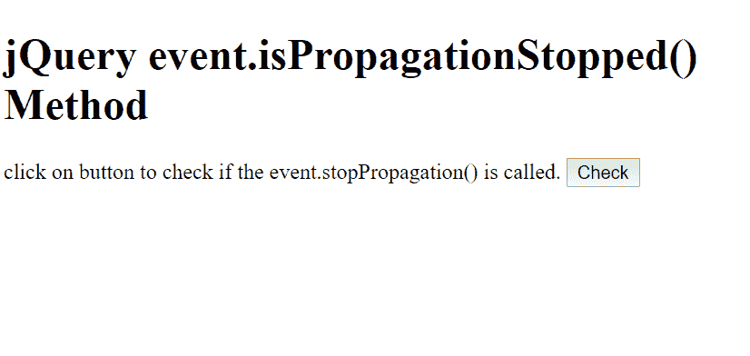
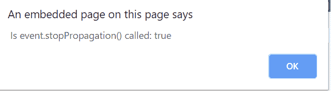
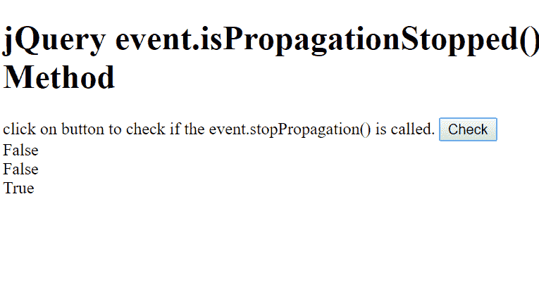

# jQuery | event . ispropagationtop()方法

> 原文:[https://www . geesforgeks . org/jquery-event-ispropagationtop-method/](https://www.geeksforgeeks.org/jquery-event-ispropagationstopped-method/)

jQuery 中的**事件. event.isPropagationStopped()方法**用于检查是否调用了对象事件. event.stopPropagation()方法。如果调用了 event.stopPropagation()，则返回 true，否则返回 false。

**语法:**

```html
event.isPropagationStopped()
```

**参数:**包含单参数**事件**，为必选项。这个参数来自事件绑定函数。

**示例 1:** 本示例使用 event.isPropagationStopped()方法检查是否调用了 event.stopPropagation()。

```html
<!DOCTYPE html>
<html>

<head>
    <script src=
"https://ajax.googleapis.com/ajax/libs/jquery/3.3.1/jquery.min.js">
    </script>

    <script>
        $(document).ready(function() {
            $("button").click(function(event) {
                event.stopPropagation();
                alert("Is event.stopPropagation() called: " 
                        +  event.isPropagationStopped());
            });
        });
    </script>
</head>

<body>
    <h1>
        jQuery event.isPropagationStopped() Method
    </h1>

    <p>
        click on button to check if the 
        event.stopPropagation() is called.
    </p>

    <button>Check</button>
</body>

</html>
```

**输出:**

*   **点击按钮前:**
    
*   **点击按钮后:**
    

**示例 2:** 本示例使用 event.isPropagationStopped()方法检查是否调用了 event.stopPropagation()。

```html
<!DOCTYPE html>
<html>

<head>
    <title>
        event.isPropagationStopped method
    </title>

    <script src=
"https://ajax.googleapis.com/ajax/libs/jquery/3.3.1/jquery.min.js">
    </script>
</head>

<body>
    <h1>
        jQuery event.isPropagationStopped() Method
    </h1>

    <p> 
        click on button to check if the 
        event.stopPropagation() is called.
    </p>

    <button>Check</button>

    <div id="GFG"></div>

    <script>
        function propStopped( event ) {
            var msg = "";

            if ( event.isPropagationStopped() ) {
                msg = "True";
            } 
            else {
                msg = "False";
            }

            $( "#GFG" ).append( "<div>" + msg + "</div>" );
        }

        $( "button" ).click(function(event) {
            propStopped( event );
            propStopped( event );
            event.stopPropagation();
            propStopped( event );
        });
    </script>
</body>

</html>        
```

**输出:**

*   **点击按钮前:**
    
*   **点击按钮后:**
    