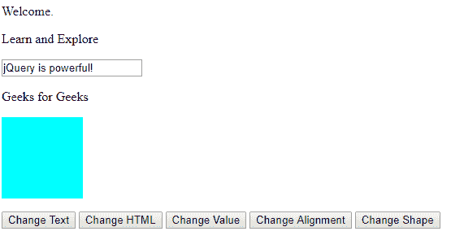
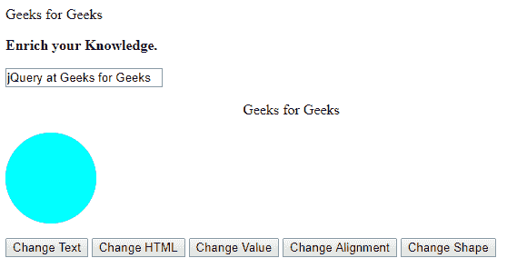

# jQuery |事件方法完整参考

> 原文:[https://www . geesforgeks . org/jquery-event-methods-complete-reference/](https://www.geeksforgeeks.org/jquery-event-methods-complete-reference/)

事件是指网站访问者在与网站(或网页)交互期间执行的操作。可以有各种类型的事件，例如

1.  用户点击按钮。
2.  用户在图像上移动鼠标指针。
3.  用户按下键盘上的任何键等。

**示例:**

```
<!DOCTYPE html>
<html>

<head>
    <script src=
"https://ajax.googleapis.com/ajax/libs/jquery/3.3.1/jquery.min.js">
</script>
    <style type="text/css">
        #e5 {
            width: 100px;
            height: 100px;
            border-radius: 0px;
            background-color: aqua;
        }
    </style>
</head>

<body>
    <p id="e1">Welcome.</p>
    <p id="e2">Learn and Explore</p>
    <p>
        <input type="text" id="e3" value="jQuery is powerful!" />
    </p>
    <p id="e4" align="left">Geeks for Geeks</p>
    <p>
        <div id="e5"></div>
    </p>
    <button id="gfg1">Change Text</button>
    <button id="gfg2">Change HTML</button>
    <button id="gfg3">Change Value</button>
    <button id="gfg4">Change Alignment</button>
    <button id="gfg5">Change Shape</button>
    <script type="text/javascript">
        $("#gfg1").click(function() {
            $("#e1").text("Geeks for Geeks");
        });
        $("#gfg2").click(function() {
            $("#e2").html("<b>Enrich your Knowledge.</b>");
        });
        $("#gfg3").click(function() {
            $("#e3").val("jQuery at Geeks for Geeks");
        });
        $("#gfg4").click(function() {
            $("#e4").attr("align", "center");
        });
        $("#gfg5").click(function() {
            $("#e5").css("border-radius", "50px");
        });
    </script>
</body>

</html>
```

**输出:**
点击按钮前:

点击按钮后:


下面给出了完整的 jQuery 事件列表:

*   [jQuery | bind()带示例](https://www.geeksforgeeks.org/jquery-bind-with-examples/)
*   [jQuery | blur()带示例](https://www.geeksforgeeks.org/jquery-blur-with-examples/)
*   [jQuery | change()带示例](https://www.geeksforgeeks.org/jquery-change-with-examples/)
*   [jQuery |点击()附带示例](https://www.geeksforgeeks.org/jquery-click-with-examples/)
*   [jQuery | dblclick()带示例](https://www.geeksforgeeks.org/jquery-dblclick-with-examples/)
*   [jQuery | event.currentTarget 属性](https://www.geeksforgeeks.org/jquery-event-currenttarget-property/)
*   [jQuery | event.data 属性](https://www.geeksforgeeks.org/jquery-event-data-property/)
*   [jQuery | event.delegateTarget 属性](https://www.geeksforgeeks.org/jquery-event-delegatetarget-property/)
*   [jQuery | event . isdefaultprevented()方法](https://www.geeksforgeeks.org/jquery-event-isdefaultprevented-method/)
*   [jQuery | event . isimmediatepropationstop()方法](https://www.geeksforgeeks.org/jquery-event-isimmediatepropagationstopped-method/)
*   [jQuery | event . ispropagationtop()方法](https://www.geeksforgeeks.org/jquery-event-ispropagationstopped-method/)
*   [jQuery | event.namespace 属性](https://www.geeksforgeeks.org/jquery-event-namespace-property/)
*   [带有示例的 jQuery | event.pageX 属性](https://www.geeksforgeeks.org/jquery-event-pagex-property-with-examples/)
*   [jQuery | event.pageY 属性，带示例](https://www.geeksforgeeks.org/jquery-event-pagey-property-with-examples/)
*   [jQuery | event.preventDefault()方法](https://www.geeksforgeeks.org/jquery-event-preventdefault-method/)
*   [jQuery | event.relatedTarget 属性示例](https://www.geeksforgeeks.org/jquery-event-relatedtarget-property-with-example/)
*   [带有示例的 jQuery | event.result 属性](https://www.geeksforgeeks.org/jquery-event-result-property-with-examples/)
*   [jQuery | event . stop immediate propagation()方法](https://www.geeksforgeeks.org/jquery-event-stopimmediatepropagation-method/)
*   [jQuery | event . stopperpagation()方法](https://www.geeksforgeeks.org/jquery-event-stoppropagation-method/)
*   [jQuery | event.target 属性示例](https://www.geeksforgeeks.org/jquery-event-target-property-with-example/)

*   [jQuery | event.timeStamp 属性，示例](https://www.geeksforgeeks.org/jquery-event-timestamp-property-with-example/)
*   [jQuery | event.type 属性](https://www.geeksforgeeks.org/jquery-event-type-property-with-examples/)
*   [jQuery | event . what 属性](https://www.geeksforgeeks.org/jquery-event-which-property-with-examples/)
*   [jQuery | focus()带示例](https://www.geeksforgeeks.org/jquery-focus-with-examples/)
*   [jQuery | focusin()带示例](https://www.geeksforgeeks.org/jquery-focusin-with-examples/)
*   [jQuery | focusout()带示例](https://www.geeksforgeeks.org/jquery-focusout-with-example/)
*   [jQuery |悬停()带示例](https://www.geeksforgeeks.org/jquery-hover-with-examples/)
*   [jQuery | Keydown()带示例](https://www.geeksforgeeks.org/jquery-keydown-with-examples/)
*   [jQuery | keypress()](https://www.geeksforgeeks.org/jquery-keypress/)
*   [jQuery | keyup()带示例](https://www.geeksforgeeks.org/jquery-keyup-with-examples/)
*   [jQuery | load()示例](https://www.geeksforgeeks.org/jquery-load-with-examples/)
*   [jQuery | mousedown()带示例](https://www.geeksforgeeks.org/jquery-mousedown-with-examples/)
*   [jQuery | mouseenter()带示例](https://www.geeksforgeeks.org/jquery-mouseenter-with-examples/)
*   [jQuery | mouseleave()带示例](https://www.geeksforgeeks.org/jquery-mouseleave-with-examples/)
*   [jQuery | mousemove()带示例](https://www.geeksforgeeks.org/jquery-mousemove-with-examples/)
*   [jQuery | mouseout()带示例](https://www.geeksforgeeks.org/jquery-mouseout-with-examples/)
*   [jQuery |鼠标悬停()，示例](https://www.geeksforgeeks.org/jquery-mouseover-with-examples/)
*   [jQuery | mouseup()带示例](https://www.geeksforgeeks.org/jquery-mouseup-with-examples/)
*   [jQuery | on()带示例](https://www.geeksforgeeks.org/jquery-on-with-examples/)
*   [jQuery | one()带示例](https://www.geeksforgeeks.org/jquery-one-with-examples/)
*   [jQuery | ready()带示例](https://www.geeksforgeeks.org/jquery-ready-with-examples/)
*   [jQuery | resize()示例](https://www.geeksforgeeks.org/jquery-resize-with-examples/)
*   [jQuery |滚动()带示例](https://www.geeksforgeeks.org/jquery-scroll-with-examples/)
*   [jQuery |选择()并举例](https://www.geeksforgeeks.org/jquery-select-with-examples/)
*   [jQuery |提交()并附示例](https://www.geeksforgeeks.org/jquery-submit-with-examples/)
*   [jQuery | trigger()方法](https://www.geeksforgeeks.org/jquery-trigger-method/)
*   [jQuery | triggerHandler()方法](https://www.geeksforgeeks.org/jquery-triggerhandler-method/)
*   [jQuery | undelete()带示例](https://www.geeksforgeeks.org/jquery-undelegate-with-examples/)