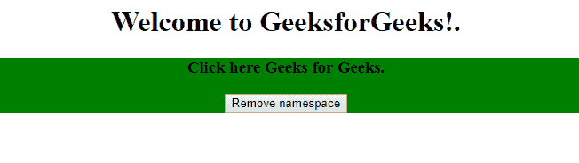
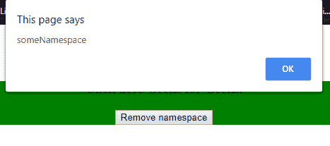
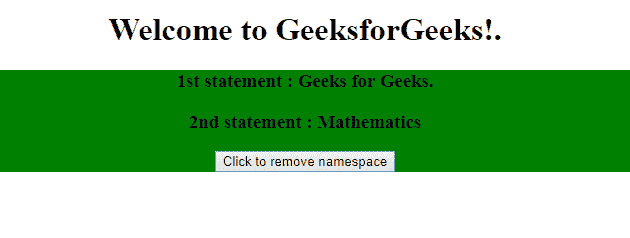
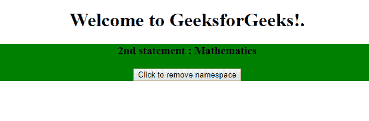

# jQuery | event.namespace 属性

> 原文:[https://www . geesforgeks . org/jquery-event-namespace-property/](https://www.geeksforgeeks.org/jquery-event-namespace-property/)

jQuery 中的 **event.namespace 属性**用于在事件被触发时返回自定义的命名空间。它用于根据所使用的命名空间不同地处理任务。

**语法:**

```html
event.namespace
```

**参数:**该属性包含单参数**事件**，这是必需的。它返回自定义命名空间，并且来自事件绑定函数。

**示例 1:** 本示例使用 event.namespace 属性返回和移除命名空间。

```html
<!DOCTYPE html>
<html>

<head>
    <title>
        jQuery event.namespace Property
    </title>

    <script src=
"https://ajax.googleapis.com/ajax/libs/jquery/3.3.1/jquery.min.js">
    </script>

    <!-- Script to use event.namespace property -->
    <script>
        $(document).ready(function() {
            $("h3").on("custom.someNamespace", function(event) {
                alert(event.namespace);
            });

            $("h3").click(function(event) {
                $(this).trigger("custom.someNamespace");
            });  

            $("button").click(function() {
                $("h3").off("custom.someNamespace");
            });
    });  
    </script>
</head>

<body>
    <center>

        <h1>Welcome to GeeksforGeeks!.</h1> 

        <div style="background-color:green">
            <h3> Click here Geeks for Geeks.</h3>
            <button>Remove namespace</button>
        </div>

    </center>
 </body>

</html>
```

**输出:**
**点击元素 h3 前:**

**点击元素 h3 后:**


**示例 2:** 本示例使用 click.mySomething 命名空间来滑动切换内容。

```html
<!DOCTYPE html>
<html>

<head>
    <title>
        jQuery event.namespace Property
    </title>

    <script src=
"https://ajax.googleapis.com/ajax/libs/jquery/3.3.1/jquery.min.js">
    </script>

    <!-- Script to use event.namespace to 
        slideToggle content -->
    <script>
        $(document).ready(function() {
            $("h3").on("click.mySomething", function() {
                $(this).slideToggle();
            });

            $("button").click(function() {
                $("h3").off("click.mySomething");
            });
        });
    </script>
</head>

<body>
    <center>
        <h1>Welcome to GeeksforGeeks!.</h1> 

        <div style="background-color:green">
            <h3>1st statement : Geeks for Geeks.</h3>
            <h3>2nd statement : Mathematics</h3>
            <button>Click to remove namespace</button>
        </div>
    </center>
 </body>

</html>
```

**输出:**
**点击前第一个语句:**

**点击后第一个语句:**
