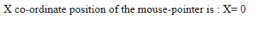
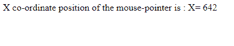

# 带有示例的 jQuery | event.pageX 属性

> 原文:[https://www . geesforgeks . org/jquery-event-pagex-property-with-examples/](https://www.geeksforgeeks.org/jquery-event-pagex-property-with-examples/)

**事件. pageX** 是 jQuery 中的一个内置属性，用于查找鼠标指针**相对于文档左边缘**的位置。
**语法:**

```
event.pageX

```

**参数:**它不接受任何参数，因为它是属性而不是函数。
**返回值:**返回鼠标指针相对于文档左边缘的位置。
**jQuery 代码显示 event.pageX 的工作属性:**
**代码#1:**
在下面的代码中，鼠标指针的左上角位置正在显示。

```
<html>

<head>
    <script 
    src="https://ajax.googleapis.com/ajax/libs/jquery/3.3.1/jquery.min.js">
    </script>
    <script>
        <!-- jQuery code to demonstrate the x-coordinate of mouse pointer-->
        $(document).ready(function() {
            $(document).mousemove(function(event) {
                $("span").text("X= " + event.pageX);
            });
        });
    </script>
</head>

<body>
    <!-- top left position of the pointer will show here -->
    <p>X co-ordinate position of the mouse-pointer is : <span></span></p>
</body>

</html>
```

**输出:**


**代码#2:**
在下面的代码中，显示了鼠标指针的右上角位置。

```
<html>

<head>
    <script
    src="https://ajax.googleapis.com/ajax/libs/jquery/3.3.1/jquery.min.js">
    </script>
    <script>
        <!-- jQuery code o demonstrate the mouse pointer position -->
        $(document).ready(function() {
            $(document).mousemove(function(event) {
                $("span").text("X= " + event.pageX);
            });
        });
    </script>
</head>

<body>
    <!-- top right corner position of the pointer will show here -->
    <p>X co-ordinate position of the mouse-pointer is : <span></span></p>
</body>

</html>
```

**输出:**
