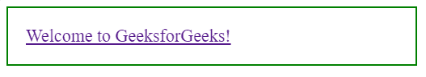
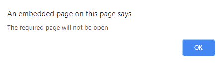
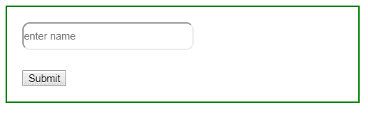
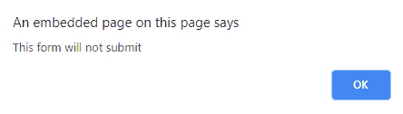

# jQuery | event.preventDefault()方法

> 原文:[https://www . geeksforgeeks . org/jquery-event-preventdefault-method/](https://www.geeksforgeeks.org/jquery-event-preventdefault-method/)

jQuery 中的 **preventDefault()方法**用于停止所选元素的默认动作发生。它还用于检查是否为所选元素调用了 preventDefault()方法。

**语法:**

```
event.preventDefault()
```

**参数:**不接受任何参数。

**返回值:**返回已应用更改的选定元素。

**示例 1:** 本示例使用 preventDefault()方法停止打开新链接。

```
<!DOCTYPE html>
<html>

<head>
    <title>
        jQuery event.preventDefault() Method
    </title>

    <script src=
"https://ajax.googleapis.com/ajax/libs/jquery/3.3.1/jquery.min.js">
    </script>

    <style>
        body {
            width: 50%;
            height: 40%;
            padding: 20px;
            border: 2px solid green;
            font-size: 20px;
        }
    </style>

    <!-- Script to use event.preventDefault() method -->
    <script>
        $(document).ready(function() {
            $("a").click(function(event) {
                event.preventDefault();
                alert("The required page will not be open");
            });
        });
    </script>
</head>

<body>
    <a href="https://www.geeksforgeeks.org">
        Welcome to GeeksforGeeks!
    </a>
</body>

</html>
```

**输出:**
**点击链接前:**

**点击链接后:**


**示例 2:** 本示例使用 event.preventDefault()方法停止提交表单。

```
<!DOCTYPE html>
<html>

<head>

    <script src=
"https://ajax.googleapis.com/ajax/libs/jquery/3.3.1/jquery.min.js">
    </script>

    <style>
        body {
            width: 50%;
            height: 40%;
            padding: 20px;
            border: 2px solid green;
            font-size: 20px;
        }
        input {
            width: 220px;
            height: 30px;
            border-radius: 10px;
        }
    </style>

    <!-- Script to use event.preventDefault() method -->
    <script>
        $(document).ready(function() {
            $("button").click(function(event) {
                event.preventDefault();
                alert("This form will not submit");
            });
        });
    </script>
</head>

<body>

    <input type="text" placeholder="enter name" />

    <br><br>

    <button>Submit </button>
</body>

</html>
```

**输出:**
**点击按钮前:**

**点击按钮后:**
