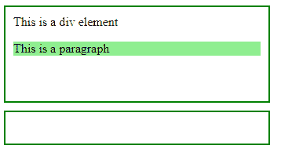
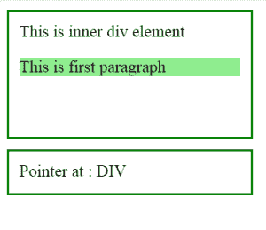

# jQuery | event.relatedTarget 属性示例

> 原文:[https://www . geesforgeks . org/jquery-event-related target-property-with-example/](https://www.geeksforgeeks.org/jquery-event-relatedtarget-property-with-example/)

**事件。相关目标**是 jQuery 中的一个内置属性，用于查找鼠标移动时哪个元素被输入或退出。
**语法:**

```
event.relatedTarget

```

**参数:**它不接受任何参数，因为它是属性而不是函数。
**返回值:**返回鼠标移动时进入或退出的元素。

**显示事件相关目标属性工作的 jQuery 代码:**

```
<html>

<head>
    <script 
    src="https://ajax.googleapis.com/ajax/libs/jquery/3.3.1/jquery.min.js">
    </script>
    <script>
        <!-- jQuery code to show working of this property -->
        $(document).ready(function() {
            $("div, p").mouseenter(function(event) {
                $("#d2").html("Pointer at : " + event.relatedTarget.nodeName);
            });
        });
    </script>
    <style>
        #d1 {
            height: 100px;
            width: 50%;
            padding: 10px;
            border: 2px solid green;
        }

        #d2 {
            height: 20px;
            width: 50%;
            padding: 10px;
            margin-top: 10px;
            border: 2px solid green;
        }
    </style>
</head>

<body>
    <!-- this is outer div element -->
    <div id="d1">
        <!-- this is inner div element -->
        <div>This is a div element </div>
        <!-- this is paragraph element -->
        <p style="background-color:lightgreen">This is a paragraph</p>
    </div>
    <div id="d2" />
</body>

</html>
```

**输出:**
在鼠标指针移到 div 元素上之前-


鼠标指针移动到 div 元素上后-
