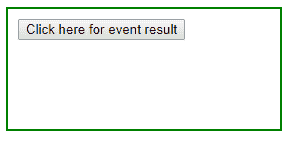
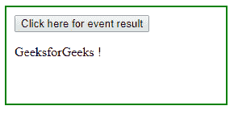

# 带有示例的 jQuery | event.result 属性

> 原文:[https://www . geesforgeks . org/jquery-event-result-property-with-examples/](https://www.geeksforgeeks.org/jquery-event-result-property-with-examples/)

**事件.结果**是 jQuery 中的一个内置属性，用于查找由指定事件启动的事件处理程序返回的最后一个和前一个值。
**语法:**

```
event.result

```

**参数:**它不接受任何参数，因为它是属性而不是函数。
**返回值:**返回由指定事件启动的事件处理程序返回的上一个值。

**显示 event.result 属性工作的 jQuery 代码:**

```
<html>

<head>
    <script src="https://code.jquery.com/jquery-1.10.2.js">
    </script>
    <style>
        div {
            width: 40%;
            height: 100px;
            margin: 10px;
            padding: 10px;
            display: block;
            border: 2px solid green;
        }
    </style>
</head>

<body>
    <div>
        <!-- click on this button -->
        <button>Click here for event result</button>
        <p></p>
    </div>
    <!-- jQuery code to show working of this property -->
    <script>
        $("button").click(function(event) {
            return "Geeks for Geeks !";
        });
        $("button").click(function(event) {
            $("p").html(event.result);
        });
    </script>
</body>

</html>
```

**输出:**
点击按钮前-


点击按钮-
后