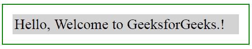
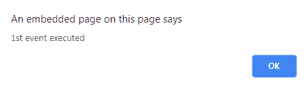
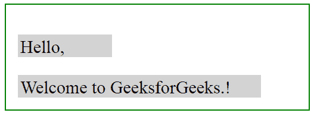
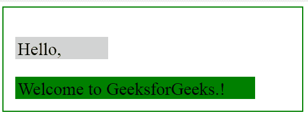

# jQuery | event . stop immediate propagation()方法

> 原文:[https://www . geeksforgeeks . org/jquery-event-stop immediatepropagation-method/](https://www.geeksforgeeks.org/jquery-event-stopimmediatepropagation-method/)

**event . stop immediate propagation()**是 jQuery 中的一个内置方法，用于*为所选元素停止执行其余的事件处理程序*。

**语法:**

```
event.stopImmediatePropagation()

```

**参数:**不需要参数。

**返回值:**此方法返回应用了更改的选定元素。

**示例-1:** 这里，只有第一个弹出框会出现，之后这个方法会阻止另一个弹出框出现。

```
<!DOCTYPE html>
<html>

<head>
    <script src=
"https://ajax.googleapis.com/ajax/libs/jquery/3.3.1/jquery.min.js">
  </script>
    <style>
        body {
            width: 70%;
            height: 40%;
            font-size: 30px;
            padding: 20px;
            border: 2px solid green;
        }

        div {
            display: block;
            background-color: lightgrey;
            padding: 4px;
        }
    </style>

    <script>
        $(document).ready(function() {
            $("div").click(function(event) {
                alert("1st event executed");
                event.stopImmediatePropagation();
            });
            $("div").click(function(event) {
                alert("2nd event executed");
            });
            $("div").click(function(event) {
                alert("3rd event executed");
            });
        });
    </script>
</head>

<body>

    <div>Hello, Welcome to GeeksforGeeks.!</div>

</body>

</html>
```

**输出:**

**点击前:**


**点击后:**


**示例-2:**

```
<!DOCTYPE html>
<html lang="en">

<head>
    <script src=
"https://ajax.googleapis.com/ajax/libs/jquery/3.3.1/jquery.min.js">
  </script>
    <style>
        body {
            width: 70%;
            height: 40%;
            font-size: 30px;
            padding: 20px;
            border: 2px solid green;
        }

        p {
            display: block;
            padding: 4px;
            height: 30px;
            width: 150px;
            background-color: lightgrey;
        }

        div {
            display: block;
            padding: 4px;
            height: 30px;
            width: 400px;
            background-color: lightgrey;
        }
    </style>

</head>

<body>

    <p>Hello, </p>
    <div>Welcome to GeeksforGeeks.!</div>

    <script>
        $("p").click(function(event) {
            event.stopImmediatePropagation();
        });
        $("p").click(function(event) {
            // This function will not executed
            $(this).css("background-color", "yellow");
        });
        $("div").click(function(event) {
            // This function will executed
            $(this).css("background-color", "green");
        });
    </script>
</body>

</html>
```

**输出:**
**点击前:**


**之后点击“p”和“div”元素。事件仅针对 div 元素执行:**
