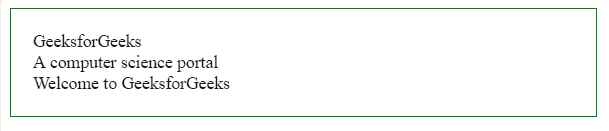
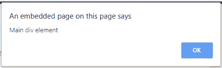
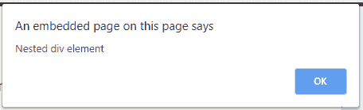

# jQuery | event . stopperpagation()方法

> 原文:[https://www . geesforgeks . org/jquery-event-stopper propagation-method/](https://www.geeksforgeeks.org/jquery-event-stoppropagation-method/)

**event . stopperpagement()方法**是 jQuery 中的一个内置方法，用于停止窗口传播。在 **DOM** 树中，当使用子元素和父元素设置事件时，如果您点击子元素事件，它将同时调用子元素和父元素。所以在这个方法的帮助下，除了选中的元素外，其他元素不会出现这个弹出窗口。

**语法:**

```html
event.stopPropagation()
```

**参数:**接受单个参数，为必选项。这个参数来自绑定函数。

**返回值:**该方法返回由 stopPropagation()方法进行了指定更改的选定元素。

**示例:**此示例说明了 event.stopPropagation()方法。

```html
<!DOCTYPE html>
<html>

<head>
    <title>
        jQuery event.stopPropagation() Method
    </title>

    <script src=
"https://ajax.googleapis.com/ajax/libs/jquery/3.3.1/jquery.min.js">
    </script>

    <style>
        .main {
            border:1px solid green;
            padding:20px;
            width:60%;
        }
    </style>

    <!-- Script to use jQuery event.stopPropagation() Method -->
    <script>
        $(document).ready(function() {
            $(".main").click(function() {
                alert("Main div element");
            });
            $(".GFG").click(function(event) {
                event.stopPropagation();
                alert("Nested div element");
            });
            $(".geeks").click(function(event) {
                alert("Second nested div element");
            });
        });
    </script>
</head>

<body>

    <!-- Click on element to display alert message -->
    <div class="main">
        GeeksforGeeks
        <div class="GFG">
            A computer science portal
            <div class="geeks">
                Welcome to GeeksforGeeks
            </div>
        </div>
    </div>

</body>

</html>
```

**输出:**

*   **点击按钮前:**
    
*   **点击按钮后:**
    
    