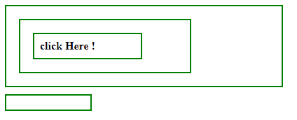

# jQuery | event.target 属性示例

> 原文:[https://www . geeksforgeeks . org/jquery-event-target-property-with-example/](https://www.geeksforgeeks.org/jquery-event-target-property-with-example/)

**事件目标**是 jQuery 中的一个内置属性，用于查找哪个 DOM 元素将启动该事件。
**语法:**

```
event.target

```

**参数:**它不接受任何参数，因为它是属性而不是函数。
**返回值:**返回触发事件的 DOM 元素。

**显示事件工作的 jQuery 代码. target Property 属性:**

```
<html>

<head>
    <style>
        span,
        strong,
        p {
            padding: 8px;
            display: block;
            border: 2px solid green;
            width: 50%;
            margin: 10px;
        }

        #output {
            margin: 10px;
            padding: 10px;
            width: 100px;
            border: 2px solid green;
            display: block;
        }
    </style>
    <script src="https://code.jquery.com/jquery-1.10.2.js">
    </script>
</head>

<body>
    <div>
        <p>
            <strong><span>click Here !</span></strong>
        </p>
    </div>
    <!-- output will show inside this block -->
    <div id="output"></div>
    <!-- jQuery code to show working of this property -->
    <script>
        $("body").click(function(event) {
            $("#output").html("clicked: " + event.target.nodeName);
        });
    </script>
</body>

</html>
```

**输出:**
点击任意位置前-


点击 p 元素内部后-


点击强元素内部后-


点击 SPAN 元素内部后-
