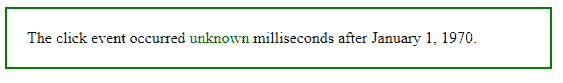
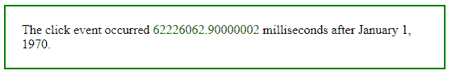

# jQuery | event.timeStamp 属性，示例

> 原文:[https://www . geesforgeks . org/jquery-event-timestamp-property-with-example/](https://www.geeksforgeeks.org/jquery-event-timestamp-property-with-example/)

**事件.时间戳**是 jQuery 中的一个内置属性，用于测量浏览器创建的事件时间和 1970 年 1 月 1 日之间的毫秒差。
**语法:**

```
event.timeStamp

```

**参数:**它不接受任何参数，因为它是属性而不是函数。
**返回值:**返回 1970 年 1 月 1 日事件触发后的毫秒数。

**显示事件工作的 jQuery 代码. timeStamp 属性:**

```
<html>

<head>
    <script src="https://code.jquery.com/jquery-1.10.2.js">
    </script>
    <script>
        <!-- jQuery code to show the working of event.timeStamp property -->
        $(document).ready(function() {
            $("p").click(function(event) {
                $("span").text(event.timeStamp);
            });
        });
    </script>
    <style>
        p {
            width: 80%;
            padding: 20px;
            display: block;
            border: 2px solid green;
        }
    </style>
</head>

<body>
    <!-- click on this paragraph -->
    <p>The click event occurred <span style="color:green">unknown</span>
            milliseconds after January 1, 1970.</p>
</body>

</html>
```

**输出:**
点击前一段-


点击后段落-
