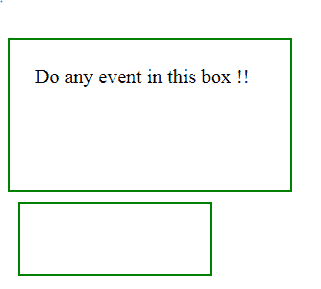
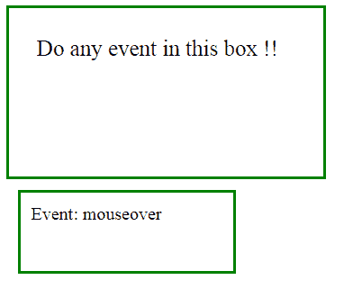
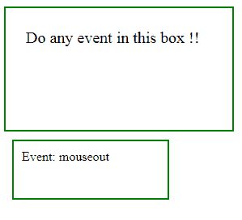

# 带有示例的 jQuery | event.type 属性

> 原文:[https://www . geesforgeks . org/jquery-event-type-property-with-examples/](https://www.geeksforgeeks.org/jquery-event-type-property-with-examples/)

**事件类型**是 jQuery 中的一个内置属性，用于返回**哪个事件类型被启动。**
**语法:**

```html
event.type

```

**参数:**它不接受任何参数，因为它是属性而不是函数。
**返回值:**返回触发的事件类型。
**显示事件类型属性工作的 jQuery 代码:**

```html
<html>

<head>
    <!-- jQuery code to show the working of this property -->
    <script src="https://code.jquery.com/jquery-1.10.2.js">
    </script>
    <script>
        $(document).ready(function() {
            $("#div1").on("click dblclick mouseover mouseout",
            function(event) {
                $(".div2").html("Event: " + event.type);
            });
        });
    </script>
    <style>
        #div1 {
            width: 230px;
            height: 100;
            display: block;
            padding: 25px;
            border: 2px solid green;
            font-size: 20px;
        }

        .div2 {
            width: 170px;
            margin: 10px;
            height: 50px;
            padding: 10px;
            border: 2px solid green;
        }
    </style>
</head>

<body>
    <!-- move mouse over this box -->
    <div id="div1">Do any event in this box !!</div>
    <!-- events are being shown in this box -->
    <div class="div2"></div>
</body>

</html>
```

**输出:**
移动鼠标到任何地方之前-


鼠标移到大框上后-


鼠标移出大框后-
