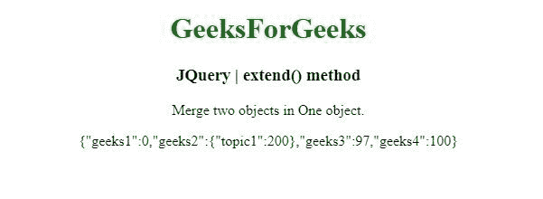
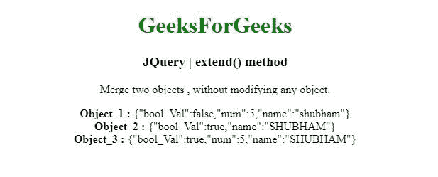

# jQuery | extend()方法

> 原文:[https://www.geeksforgeeks.org/jquery-extend-method/](https://www.geeksforgeeks.org/jquery-extend-method/)

jQuery 中的这个 **extend()** 方法用于将两个或多个对象的内容合并到第一个对象中。

**语法:**

```html
jQuery.extend( [deep ], target, object1 [, objectN ] )

```

**参数:**extend()方法接受上面提到并在下面描述的四个参数:

*   **deep:** 这个参数是合并变递归。
*   **目标:**此参数是要扩展的对象。它将接收新的属性。
*   **对象 1:** 此参数是包含要合并的附加属性的对象。
*   **对象 1:** 此参数是包含要合并的属性的附加对象。

**返回值:**合并后返回对象。

下面的例子说明了扩展()方法在 jQuery 中的使用:

**示例 1:** 在本例中， **extend()方法**将两个对象合并为一个。

```html
<!DOCTYPE html>
<html>
<head>
<meta charset="utf-8">
<title>JQuery | extend() method</title> 
<script src="https://code.jquery.com/jquery-3.4.1.js">
</script>

</head>
<body style="text-align:center;"> 

    <h1 style="color: green"> 
        GeeksForGeeks 
    </h1> 

    <h3>JQuery | extend() method</h3>
    <p>Merge two objects in One object.</p>
    <p id = "geeks"> </p>
    <script>
        var value1 = {
          geeks1: 0,
          geeks2: { topic1: 52, topic2: 100 },
          geeks3: 97
        };
        var value2 = {
          geeks2: { topic1: 200 },
          geeks4: 100
        };

        // Merge value2 into value1
        $.extend( value1, value2 );

        // Assuming JSON.stringify - not available in IE<8
        $( "#geeks" ).append( JSON.stringify( value1 ) );
    </script>
</body>
</html>                                                            
```

**输出:**


**示例 2:** 在本例中， **extend()方法**合并两个对象，不修改任何对象。

```html
<!DOCTYPE html>
<html>
<head>
<meta charset="utf-8">
<title>JQuery | extend() method</title> 
<script src="https://code.jquery.com/jquery-3.4.1.js"></script>

</head>
<body style="text-align:center;"> 

    <h1 style="color: green"> 
        GeeksForGeeks 
    </h1> 

    <h3>JQuery | extend() method</h3>
    <p>Merge two objects, without modifying any object.</p>
    <p id = "geeks"> </p>
    <script>
        var Object_1 = { bool_Val: false, num: 5, name: "shubham" };
        var Object_2 = { bool_Val: true, name: "SHUBHAM" };

        // Merge Object_1 and Object_2, without modifying Object_1
        var Object_3 = $.extend( {}, Object_1, Object_2 );

        // Assuming JSON.stringify - not available in IE<8
        $( "#geeks" ).append(
 "<b>Object_1 : </b>" + JSON.stringify( Object_1 ) + "<br>" );
        $( "#geeks" ).append(
 "<b>Object_2 : </b>" + JSON.stringify( Object_2 ) + "<br>" );
        $( "#geeks" ).append(
 "<b>Object_3 : </b>" + JSON.stringify( Object_3 ) + "<br>" );
    </script>
</body>
</html>
```

**输出:**
