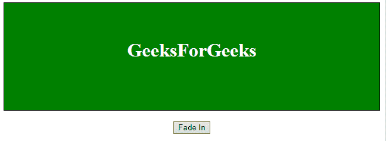

# jQuery | fadeIn()方法

> 原文:[https://www.geeksforgeeks.org/jquery-fadein-method/](https://www.geeksforgeeks.org/jquery-fadein-method/)

jQuery 中的 **fadeIn()方法**用于将选定元素的不透明度从隐藏更改为可见。隐藏的元素将不会显示。

**语法:**

```
$(selector).fadeIn( speed, easing, callback )
```

**参数:**该方法接受三个参数，如上所述，如下所述:

*   **速度:**为可选参数，用于指定淡入淡出效果的速度。速度的默认值是 400 毫秒。速度的可能值有:
    *   毫秒
    *   “慢”
    *   “快”
*   **缓和:**是可选参数，用于指定元素到动画不同点的速度。宽松的默认值是“摇摆”。宽松政策的可能价值是:
    *   “摇摆”
    *   “线性”
*   **回调:**为可选参数。回调函数在 fadeIn()方法完成后执行。

以下示例说明了 jQuery 中的 fadeIn()方法:

**例 1:** 本例描述了速度为 1000 毫秒的 fadeIn()方法。

```
<!DOCTYPE html>  
<html>  
    <head> 
        <title> 
            fadeIn() Method in jQuery
        </title>

        <style>
            #Outer {
                border: 1px solid black;
                padding-top: 40px;
                height: 140px;
                background: green;
                display: none;
            }
        </style>

        <script src=
"https://ajax.googleapis.com/ajax/libs/jquery/3.3.1/jquery.min.js">
        </script>
    </head>

    <body style = "text-align:center;">  

        <div id= "Outer">
            <h1 style = "color:white;" >  
                GeeksForGeeks  
            </h1>  
        </div><br>

        <button id = "btn"> 
            Fade In
        </button> 

        <!-- jQuery script of fadeIn() method -->
        <script> 
            $(document).ready(function() {
                $("#btn").click(function() {
                    $("#Outer").fadeIn(1000);
                });
            });
        </script> 
    </body>  
</html> 
```

**输出:**
**之前点击按钮:**

**之后点击按钮:**


**例 2:** 本例描述了带有缓和“摇摆”的 fadeIn()方法。

```
<!DOCTYPE html>  
<html>  
    <head> 
        <title> 
            fadeIn() Method in jQuery
        </title>

        <style>
            #Outer {
                border: 1px solid black;
                padding-top: 40px;
                height: 140px;
                background: green;
                display: none;
            }
        </style>

        <script src=
"https://ajax.googleapis.com/ajax/libs/jquery/3.3.1/jquery.min.js">
        </script>
    </head>

    <body style = "text-align:center;">  

        <div id= "Outer">
            <h1 style = "color:white;" >  
                GeeksForGeeks  
            </h1>  
        </div><br>

        <button id = "btn"> 
            Fade In
        </button> 

        <!-- jQuery script of fadeIn() method -->
        <script> 
            $(document).ready(function() {
                $("#btn").click(function() {
                    $("#Outer").fadeIn("swing");
                });
            });
        </script> 
    </body>  
</html> 
```

**输出:**
**之前点击按钮:**

**之后点击按钮:**
