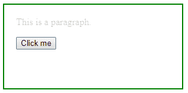

# jQuery | fadeTo()带示例

> 原文:[https://www.geeksforgeeks.org/jquery-fadeto-with-examples/](https://www.geeksforgeeks.org/jquery-fadeto-with-examples/)

**fadeTo()** 是 jQuery 中的一个内置方法，用于更改所选元素的不透明度。
**语法:**

```
$(selector).fadeTo(speed, opacity, easing, call_function)

```

这里选择器是被选择的元素。
**参数:**接受以下指定的四个参数-

*   **速度:**指定淡入淡出效果的速度。
*   **不透明度:**指定淡化，该值必须在 0.0 到 1.0 之间。
*   **缓和:**指定动画不同点的速度。
*   **call_function:** 是可选参数，执行 fadeTo 方法后执行一个功能。

**返回值:**不返回值。

<center>**jQuery 代码展示 fadeTo()方法的工作方式:**</center>

**代码#1:**
在下面的代码中，没有传递可选的函数参数。

```
<html>

<head>
    <script src="https://code.jquery.com/jquery-1.10.2.js">
    </script>
    <style>
        body {
            width: 40%;
            height: 100px;
            border: 2px solid green;
            padding: 20px;
        }
    </style>

</head>

<body>
    <!-- click on this paragraph and this paragraph will fade out -->
    <p>
        This paragraph will fade out !
    </p>
    <!-- after clicking on this paragraph this paragraph will 
 not fade out -->
    <p>
        This paragraph will not fade !
    </p>
    <!-- jQuery code to show working of this method -->
    <script>
        $("p:first").click(function() {
            $(this).fadeTo("slow", 0.33);
        });
    </script>

</body>

</html>
```

**输出:**
点击任意段落前-


点击第一、二段后-


**代码#2:**
在下面的代码中，传递了可选的函数参数。

```
<html>

<head>
    <script 
    src="https://ajax.googleapis.com/ajax/libs/jquery/3.3.1/jquery.min.js">
    </script>
    <!-- jQuery code to show the working of this method -->
    <script>
        $(document).ready(function() {
            $("button").click(function() {
                $("p").fadeTo(2000, 0.2, function() {
                    alert("The fadeTo effect has finished!");
                });
            });
        });
    </script>
    <style>
        body {
            width: 40%;
            height: 100px;
            border: 2px solid green;
            padding: 20px;
        }
    </style>
</head>

<body>
    <!-- this paragraph will fade out -->
    <p>This is a paragraph.</p>

    <!-- click on this button and paragraph will fade out -->
    <button>Click me</button>

</body>

</html>
```

**输出:**
之前点击【点击我】按钮-


点击【点击我】按钮后-


