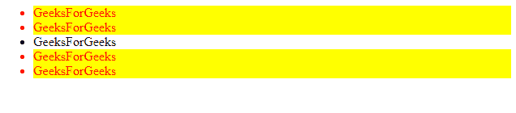
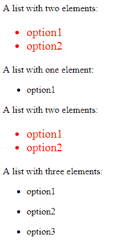

# jQuery | filter()带示例

> 原文:[https://www.geeksforgeeks.org/jquery-filter/](https://www.geeksforgeeks.org/jquery-filter/)

jQuery 是一个非常强大的工具，它帮助我们结合多种 DOM 遍历方法来随机或按顺序选择文档中的元素。大多数 DOM 遍历方法不修改元素，而是根据给定的条件过滤掉它们。
**filter()**方法用于过滤掉所有与所选条件不匹配的元素，这些匹配将被返回。
**语法:**

```html
$(selector).filter(criteria, function(index))
```

**参数:**
**条件:**它指定一个选择器表达式、一个 jQuery 对象或一组选定元素中要返回的一个或多个元素。
**函数(索引):**它为集合中的每个元素指定要运行的函数。如果函数返回 true，则保留该元素。否则，它将被移除。
**索引:**元素在集合中的索引位置。
注意:要指定多个标准，请使用逗号。

<center>**jQuery code to show the working of the filter() method**</center>

**Code #1:**
This code will return all elements matching with selected criteria.

```html
<html>

<head>
    <title>GEEKS FOR GEEKS ARTICLE</title>
    <script src="https://ajax.googleapis.com/ajax/libs/
                 jquery/3.3.1/jquery.min.js"></script>
    <script type="text/javascript">
        $(document).ready(function() {
            $("li").filter(".first, .last").css("color", "red")
                .css("backgroundColor", "yellow");
        });
    </script>
</head>

<body>
    <ul>
        <li class="first">GeeksForGeeks</li>
        <li class="first">GeeksForGeeks</li>
        <li class="middle">GeeksForGeeks</li>
        <li class="last">GeeksForGeeks</li>
        <li class="last">GeeksForGeeks</li>
    </ul>
</body>

</html>
```

**输出:**

**代码#2:**
该代码将选择与功能检查的标准相匹配的元素。这里，函数检查列表中的两个元素，并返回 true 或 false。

```html
<html>

<head>
    <title>GEEKS FOR GEEKS ARTICLE</title>
    <script src="https://ajax.googleapis.com/ajax/libs/
                 jquery/3.3.1/jquery.min.js"></script>
    <script type="text/javascript">
        $(document).ready(function() {
            $("ul").filter(function() {
                return $("li", this).length == 2;
            }).css("color", "red").css("fontSize", "20");
        });
    </script>
</head>

<body>
    A list with two elements:
    <ul>
        <li>option1</li>
        <li>option2</li>
    </ul>
    A list with one element:
    <ul>
        <li>option1</li>
    </ul>
    A list with two elements:
    <ul>
        <li>option1</li>
        <li>option2</li>
    </ul>
    A list with three elements:
    <ul>
        <li>option1</li>
    </ul>
    <ul>
        <li>option2</li>
    </ul>
    <ul>
        <li>option3</li>
    </ul>
</body>

</html>
```

**输出:**
