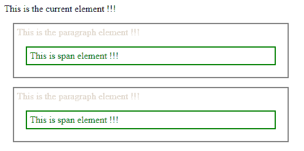
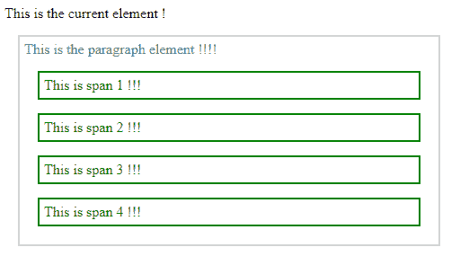

# jQuery | find()带示例

> 原文:[https://www.geeksforgeeks.org/jquery-find-with-examples/](https://www.geeksforgeeks.org/jquery-find-with-examples/)

**find()** 是 jQuery 中的一个内置方法，用于查找所选元素的所有后代元素。它将一直向下遍历到 DOM 树中所选元素的最后一片叶子。
**语法:**

```
$(selector).find()

```

这里的选择器是被选择的元素，所有的后代元素都将被找到。
**参数:**不接受任何参数。

**返回值:**返回所选元素的所有后代元素。

<center>**jQuery code to show the working of this function:**</center>

**Code #1:**
In the below code, all the “span” element connected to the “div” element get highlighted with the green color.

```
<html>

<head>
    <style>
        .descendants * {
            display: block;
            border: 2px solid grey;
            color: lightgrey;
            padding: 5px;
            margin: 15px;
        }
    </style>
    <script src="https://ajax.googleapis.com/ajax/libs/
                 jquery/3.3.1/jquery.min.js"></script>
    <script>
        $(document).ready(function() {
            $("div").find("span").css({
                "color": "green",
                "border": "2px solid green"
            });
        });
    </script>
</head>

<body>

    <div class="descendants"
         style="width:500px;">This is the current element !!!
        <p>This is the paragraph element !!!
            <span> This is span element !!!</span>
        </p>
        <p>This is the paragraph element !!!
            <span>This is span element !!!</span>
        </p>
    </div>

</body>

</html>
```

**输出:**


借助带有某些参数的 find()函数，还可以找到特定元素的所有子元素。
**语法:**

```
$(selector1).children("selector2")

```

这里 selector1 是所选元素，它的所有后代元素都将被找到。

**参数:**它接受下面指定的参数-

*   **selector2:** This is the just “*” sign which return all the children of the selected element.

    **返回值:**返回所选元素的所有子元素。
    **代码#2:**
    在下面的代码中，“p”元素的所有“span”元素都被选中并以绿色突出显示。

    ```
    <html>

    <head>
        <style>
            .descendants * {
                display: block;
                border: 2px solid lightgrey;
                color: grey;
                padding: 5px;
                margin: 15px;
            }
        </style>
        <script src="https://ajax.googleapis.com/ajax/libs/
                     jquery/3.3.1/jquery.min.js"></script>
        <script>
            $(document).ready(function() {
                $("p").find("*").css({
                    "color": "green",
                    "border": "2px solid green"
                });
            });
        </script>
    </head>

    <body>

        <div class="descendants" 
             style="width:500px;">This is the current element !
            <p>This is the paragraph element !!!!
                <span>This is span 1 !!!</span>
                <span>This is span 2 !!!</span>
                <span>This is span 3 !!!</span>
                <span>This is span 4 !!!</span>
            </p>
        </div>

    </body>

    </html>
    ```

    **输出:**
    

    jQuery 是一个开源的 JavaScript 库，它简化了 HTML/CSS 文档之间的交互，它以其“少写多做”的理念而闻名。
    跟随本 [jQuery 教程](https://www.geeksforgeeks.org/jquery-tutorials/)和 [jQuery 示例](https://www.geeksforgeeks.org/jquery-examples/)可以从头开始学习 jQuery。