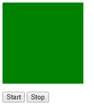
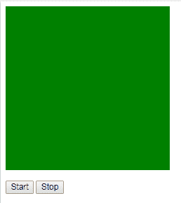

# jQuery | finish()示例

> 原文:[https://www.geeksforgeeks.org/jquery-finish-with-example/](https://www.geeksforgeeks.org/jquery-finish-with-example/)

**finish()** 是 jQuery 中的一个内置方法，用于停止当前运行的动画。
**语法:**

```html
$(selector).finish();

```

**参数:**不接受任何参数。
**返回值:**返回所选元素及其最终值。

**显示 finish()方法工作的 jQuery 代码:**

```html
<html>

<head>
    <script 
    src="https://ajax.googleapis.com/ajax/libs/jquery/3.3.1/jquery.min.js">
    </script>
    <script>
        <!-- jQuery code to show the working of this method -->
        $(document).ready(function() {
            $("#b1").click(function() {
                $("div").animate({
                    height: 200
                }, 4000);
                $("div").animate({
                    width: 200
                }, 4000);
            });
            $("#b2").click(function() {
                $("div").finish();
            });
        });
    </script>
    <style>
        div {
            background: green;
            height: 100px;
            width: 100px;
            padding: 30px;
        }
    </style>
</head>

<body>

    <div></div>

    <p>
        <!-- this button will start the animation -->
        <button id="b1">Start </button>
        <!-- this button will finish the animation -->
        <button id="b2">Stop</button>
    </p>

</body>

</html>
```

**输出:**
点击【开始】按钮前-


单击开始按钮后，动画将以其指定的速度开始，当单击停止按钮时，它会立即完成动画，并将元素返回到其最终高度和宽度值。
