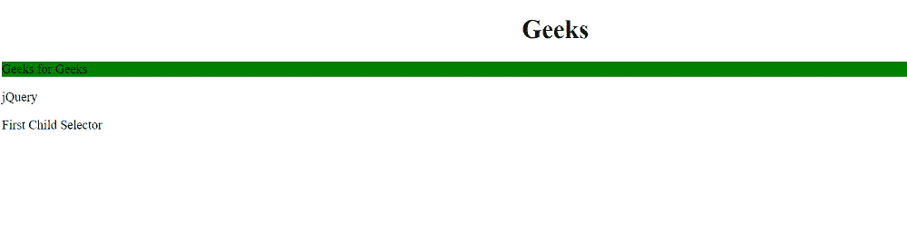
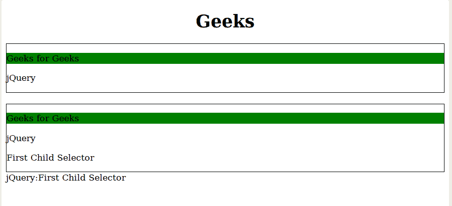

# jQuery |:第一子选择器

> 原文:[https://www.geeksforgeeks.org/jquery-first-child-selector/](https://www.geeksforgeeks.org/jquery-first-child-selector/)

这是一个 **jQuery 选择器**，用于选择其**父元素**的**第一个子元素**。
**语法:**

```html
$(":first-child")
```

**返回值:**选择并返回其父元素的第一个子元素。
**示例-1:**

## 超文本标记语言

```html
<!DOCTYPE html>
<html>
<h1>
  <center>
    Geeks 
  </center>
  </h1>

<head>
    <script src=
"https://ajax.googleapis.com/ajax/libs/jquery/3.3.1/jquery.min.js">
  </script>
    <script>
        $(document).ready(function() {
            $("p:first-child").css(
              "background-color", "green");
        });
    </script>
</head>

<body>
<div>

<p>Geeks for Geeks</p>

<p>jQuery</p>

<p>First Child Selector</p>

</div>
</body>

</html>
```

**输出:**



**示例-2:**

## 超文本标记语言

```html
<!DOCTYPE html>
<html>
<h1>
  <center>
    Geeks 
  </center>
  </h1>

<head>
    <script src=
"https://ajax.googleapis.com/ajax/libs/jquery/3.3.1/jquery.min.js">
  </script>

  <script>
        $(document).ready(function() {
            $("p:first-child").css(
              "background-color", "green");
        });
    </script>
</head>

<body>
    <div style="border:1px solid;">

<p>Geeks for Geeks</p>

<p>jQuery</p>

    </div>
    <br>

    <div style="border:1px solid;">

<p>Geeks for Geeks</p>

<p>jQuery</p>

<p>First Child Selector</p>

    </div>

    <div>jQuery:First Child Selector</div>

</body>

</html>
```

**输出:**



**支持的浏览器:**

*   谷歌 Chrome 90.0+
*   Internet Explorer 9.0
*   Firefox 3.6
*   Safari 4.0
*   歌剧 10.5