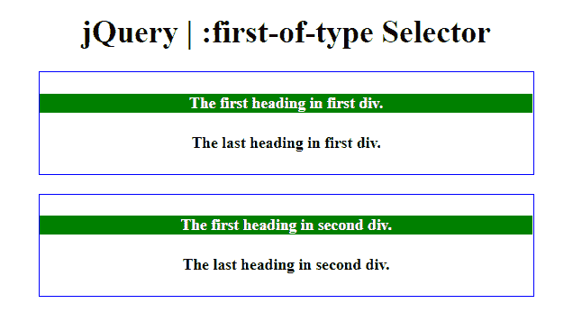
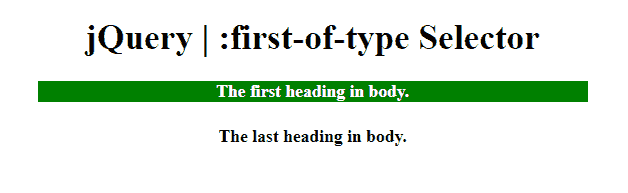

# jQuery |:第一类型选择器

> 原文:[https://www . geeksforgeeks . org/jquery-第一类型选择器/](https://www.geeksforgeeks.org/jquery-first-of-type-selector/)

**:第一类型选择器**用于选择所有元素，这些元素是其父元素的特定类型的第一个子元素。

**语法:**

```html
$(":first-of-type")
```

下面的例子说明了:jQuery 中的第一类型选择器:

**示例 1:** 本示例将父标签(div 标签)的第一个标题的背景颜色更改为绿色，文本颜色更改为白色。

```html
<!DOCTYPE html>  
<html>  

<head> 
    <title> 
        jQuery | :first-of-type Selector
    </title>

    <script src=
"https://ajax.googleapis.com/ajax/libs/jquery/3.3.1/jquery.min.js">
    </script>

    <!-- Script to use first-of-child selector -->  
    <script>
        $(document).ready(function() {
            $("h4:first-of-type").css({
                "background-color": "green", 
                "color": "white"
            });
        });
    </script>

    <style>
        option {
            font-weight: bold;
            font-size: 25px;
            color: green;
        }
        select {
            font-weight: bold;
            font-size: 25px;
            color: green;
        }
    </style>
</head> 

<body style="text-align:center; width: 500px; margin: auto">  
    <h1>  
        jQuery | :first-of-type Selector
    </h1>  

    <div style="border:1px solid blue;">
        <h4>The first heading in first div.</h4>
        <h4>The last heading in first div.</h4>
    </div><br>

    <div style="border:1px solid blue;">
        <h4>The first heading in second div.</h4>
        <h4>The last heading in second div.</h4>
    </div>
</body>  

</html>       
```

**输出:**


**示例 2:** 本示例将<正文>标签的第一个标题的背景颜色更改为绿色，文本颜色更改为白色。

```html
<!DOCTYPE html>  
<html>  

<head> 
    <title> 
        jQuery | :first-of-type Selector
    </title>

    <script src=
"https://ajax.googleapis.com/ajax/libs/jquery/3.3.1/jquery.min.js">
    </script>

    <!-- Script to use first-of-child selector -->
    <script>
        $(document).ready(function() {
            $("h4:first-of-type").css({
                "background-color": "green", 
                "color": "white"
            });
        });
    </script>

    <style>
        option {
            font-weight: bold;
            font-size: 25px;
            color: green;
        }
        select {
            font-weight: bold;
            font-size: 25px;
            color: green;
        }
    </style>
</head> 

<body style = "text-align:center; width: 500px; margin: auto">  
    <h1>  
        jQuery | :first-of-type Selector
    </h1>  

    <h4>The first heading in body.</h4>

    <h4>The last heading in body.</h4>
</body>  

</html>        
```

**输出:**


**支持的浏览器:**

*   谷歌 Chrome 90.0+
*   Internet Explorer 9.0
*   Firefox 3.6
*   Safari 4.0
*   歌剧 10.5