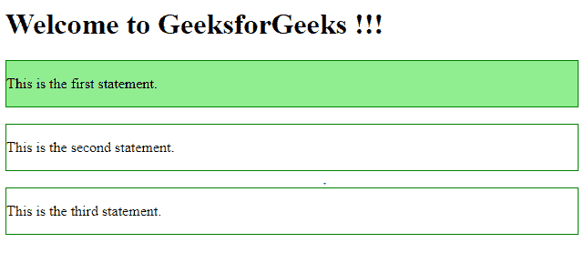

# jQuery | first()带示例

> 原文:[https://www.geeksforgeeks.org/jquery-first-with-examples/](https://www.geeksforgeeks.org/jquery-first-with-examples/)

**first()** 是 jQuery 中的一个内置函数，用于从指定的元素中选择第一个元素。
**语法:**

```html
$(selector).first()

```

这里选择器是所有元素的主类。

**参数:**不接受任何参数。

**返回值:**返回所选元素中的第一个元素。

<center>**jQuery code to show the working of this function:**</center>

**Code #1:**

```html
<html>

<head>
    <script src="https://ajax.googleapis.com/ajax/libs/
               jquery/3.3.1/jquery.min.js"></script>
    <script>
        $(document).ready(function() {
            $("div").first().css("background-color",
                                  "lightgreen");
        });
    </script>
</head>

<body>

    <h1>Welcome to GeeksforGeeks !!!</h1>
    <div style="border: 1px solid green;">
        <p>This is the first statement.</p>
    </div>
    <br>

    <div style="border: 1px solid green;">
        <p>This is the second statement.</p>
    </div>
    <br>

    <div style="border: 1px solid green;">
        <p>This is the third statement.</p>
    </div>
    <br>
</body>

</html>
```

在上面的代码中，第一个“div”元素的背景色被改变了。
**输出:**

这里也可以通过选择所选元素的**【id】**或**【类】**进行选择。
**代码#2:**

```html
<html>

<head>
    <script src="https://ajax.googleapis.com/ajax/libs/
                 jquery/3.3.1/jquery.min.js"></script>
    <script>
        $(document).ready(function() {
            $(".main").first().css("background-color",
                                     "lightgreen");
        });
    </script>
</head>

<body>

    <h1>Welcome to GeeksforGeeks !!!</h1>
    <div style="border: 1px solid green;">
        <p>This is the first statement.</p>
    </div>
    <br>

    <div class="main" style="border: 1px solid green;">
        <p>This is second statement.</p>
    </div>
    <br>

    <div class="main" style="border: 1px solid green;">
        <p>This is the third statement.</p>
    </div>
    <br>
</body>

</html>
```

在上面的代码中，第一个“main”类的元素被突出显示。
**输出:**
