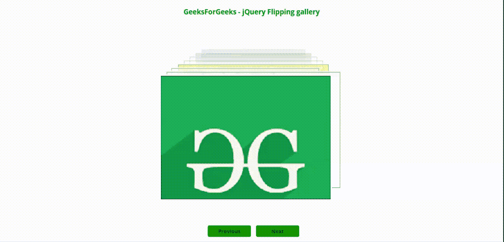
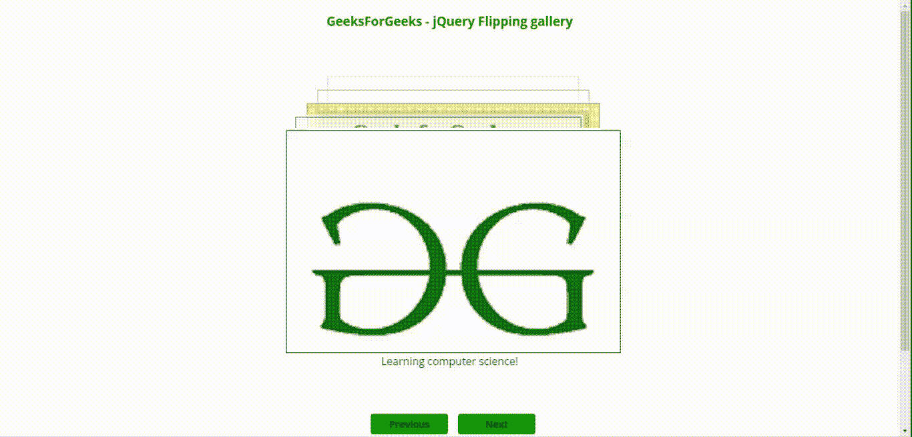
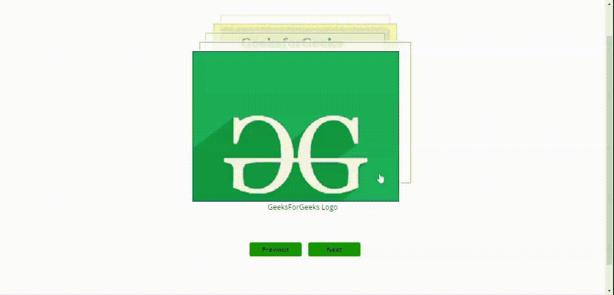

# jQuery |翻转图库插件

> 原文:[https://www . geesforgeks . org/jquery-fling-gallery-plugin/](https://www.geeksforgeeks.org/jquery-flipping-gallery-plugin/)

jQuery 提供了一个简单、美观和交互式的翻转图库插件，它可以帮助程序员通过自动播放功能从各个方向翻转图库中的许多图像。该插件通过使用 HTML 标记和简单的 javascript 函数调用来实现。

请在您的工作文件夹中下载翻转图库插件，并将所有相关文件包含在您的登录网页的标题部分。
**下载链接:**https://github.com/peachananr/flipping_gallery

**例 1:** 在下面的程序中，**flip _ gallery()**函数的简单调用显示为基本用法。**上一个**和**下一个**按钮用于处理向前或向后移动的翻转图像。

```
<!doctype html>
<html>
<head>
    <meta charset="utf-8">
    <title>jQuery Flipping Gallery Plugin </title>

    <link href=
'http://fonts.googleapis.com/css?family=Open+Sans:300, 400, 700' 
          rel='stylesheet' type='text/css'>
    <link href=
'http://fonts.googleapis.com/css?family=Noto+Serif:400, 
                     700, 400italic, 700italic'
          rel='stylesheet' type='text/css'>
    <link href='http://fonts.googleapis.com/css?family=Pacifico' 
                rel='stylesheet'
                type='text/css'>
    <link href='flipping_gallery.css' 
          rel='stylesheet' type='text/css'>

    <script type="text/javascript" 
            src="http://code.jquery.com/jquery-1.9.1.js">
     </script>
    <script type="text/javascript" 
            src="jquery.flipping_gallery.js">
      </script>
  <style>
    html
    {
      height: 90%;
    }
    body
    {
      padding: 0;
      text-align: center;
      font-family: 'open sans';
      position: relative;
      margin: 0;
      height: 80%;
    }

    .wrapper
    {
        height: auto !important;
        height: 60%;
        margin: 0 auto; 
        overflow: hidden;
    }

    a 
    {
      text-decoration: none;
    }

     .btn
     {
      display: inline-block;
      border: 4px solid black;
      border-radius: 4px;
      -moz-border-radius: 4px;
      -webkit-border-radius: 4px;
      background: green;
      display: inline-block;
      line-height: 100%;
      padding: 0.6em;
      text-decoration: none;
      color: #0d2633;
      width: 100px;
      line-height: 100%;
      font-size: 14px;
      font-family: open sans;
      font-weight: bold;
      border: none;
      margin-left: 10px;
    }

    .btns {
      width: 200px;
      margin: 20px auto;

    }

    .page-container {
      max-width: 700px;      
      margin: auto;
      position: relative;
    }

    .gallery {
      height: 300px;
      width: 500px;     
      margin: 150px auto 100px;
    } 

    img
    {
     border : 1px solid black;
    }

    </style>
    <script>
      $(document).ready( function() {
        $(".gallery").flipping_gallery();

        $(".next").click(function() {
          $(".gallery").flipForward();
          return false;
        });
        $(".prev").click(function() {
          $(".gallery").flipBackward();
          return false;
        });
      });

    </script>
</head>
<body>
    <h3 style="color:green">
           GeeksForGeeks - jQuery Flipping gallery
     </h3>             
  <div class="wrapper">            
      <div class="page-container">     
        <div class="gallery">
          <a href="#" data-caption="">
          </a>
          <a href="#" data-caption="">
          </a>
          <a href="#" data-caption="">
          </a>
          <a href="#" data-caption="">
          </a>
          <a href="#" data-caption="">
          </a>          
          <a href="#" data-caption="">
          </a>
          <a href="#" data-caption="">
          </a>
          <a href="#" data-caption="">
          </a>         
        </div>      

        <div class="navigation">
          <a href="#" class="btn prev">Previous</a>
          <a href="#" class="btn next">Next</a>
        </div>
      </div>

  </div>
</body>
</html>
```

**输出:**


**示例 2:** 在下面的程序中，使用 javascript 函数调用实现了各种选项设置。程序员可以根据应用程序的要求使用各种选项。请阅读每个选项值的注释并相应地使用。程序员可以利用*数据-字幕*属性添加字幕。

```
<!doctype html>
<html>
<head>
    <meta charset="utf-8">
    <title>jQuery Flipping Gallery Plugin </title>

    <link href=
'http://fonts.googleapis.com/css?family=Open+Sans:300, 400, 700' 
          rel='stylesheet'
          type='text/css'>
    <link href=
'http://fonts.googleapis.com/css?family=Noto+Serif:400,
                    700, 400italic, 700italic'
          rel='stylesheet' type='text/css'>
    <link href='http://fonts.googleapis.com/css?family=Pacifico'
          rel='stylesheet' type='text/css'>
    <link href='flipping_gallery.css' 
          rel='stylesheet' type='text/css'>

    <script type="text/javascript" 
            src="http://code.jquery.com/jquery-1.9.1.js">
    </script>
    <script type="text/javascript" src="jquery.flipping_gallery.js">
    </script>
  <style>
    html
    {
      height: 90%;
    }
    body
    {
      padding: 0;
      text-align: center;
      font-family: 'open sans';
      position: relative;
      margin: 0;
      height: 80%;
    }

    .wrapper
    {
        height: auto !important;
        height: 60%;
        margin: 0 auto; 
        overflow: hidden;
    }

    a 
    {
      text-decoration: none;
    }

     .btn
     {
      display: inline-block;
      border: 4px solid black;
      border-radius: 4px;
      -moz-border-radius: 4px;
      -webkit-border-radius: 4px;
      background: green;
      display: inline-block;
      line-height: 100%;
      padding: 0.6em;
      text-decoration: none;
      color: #0d2633;
      width: 100px;
      line-height: 100%;
      font-size: 14px;
      font-family: open sans;
      font-weight: bold;
      border: none;
      margin-left: 10px;
    }

    .btns {
      width: 200px;
      margin: 20px auto;

    }

    .page-container {
      max-width: 700px;      
      margin: auto;
      position: relative;
    }

    .gallery {
      height: 310px;
      width: 500px;     
      margin: 150px auto 100px;
    } 

    img
    {
     border : 1px solid black;
    }
     .navigation {
      margin-bottom: 150px;
    }
    </style>
    <script>
      $(document).ready( function() {
        $(".gallery").flipping_gallery({
/* The options for the flipping direction are "forward", or
 "backward". Default value is forward.*/
           direction: "forward", 

// Default selector is set for generation of the gallery.
           selector: "> a", 

/* Spacing between each photo in pixels in the gallery. 
    Default value is 10.*/
           spacing: 20, 

// Limit the number of photos in the viewport.
           showMaximum: 5, 

// Set the scrolling behavior. Default value is true.
           enableScroll: true,

 /* Direction to flip picture. Options are "left", 
"right", "top", "bottom". Default value is bottom.*/
           flipDirection: "left", 

// Autoplay time interval. Default value is false.
           autoplay: 1200 
        });

        $(".next").click(function() {
          $(".gallery").flipForward();
          return false;
        });
        $(".prev").click(function() {
          $(".gallery").flipBackward();
          return false;
        });
      });

    </script>
</head>
<body>
    <h3 style="color:green">
           GeeksForGeeks - jQuery Flipping gallery
     </h3>             
  <div class="wrapper">            
      <div class="page-container">     
        <div class="gallery">
          <a href="#" data-caption="GeeksForGeeks Logo">
          </a>

          <a href="#" data-caption="Learning computer science!">
          </a>

          <a href="#" data-caption="jQuery is fun.">
          </a>

          <a href="#" data-caption="Geeks week contest">
          </a>

          <a href="#" data-caption="WebTechnology classes">
          </a>

          <a href="#" data-caption="Going thr links and hyperlinks">
          </a>

          <a href="#" data-caption="HTML fundamentals">
          </a>

          <a href="#" data-caption="CSS tutorials">
          </a>         
        </div>      

        <div class="navigation">
          <a href="#" class="btn prev">Previous</a>
          <a href="#" class="btn next">Next</a>
        </div>
      </div>
  </div>
</body>
</html>
```

**输出:**


在下面的脚本中，显示了顶部翻转的选项设置。程序员同样可以利用其他选项来实现不同的翻转选项。

```
$(document).ready( function() {
    $(".gallery").flipping_gallery({
         flipDirection: "top",
         autoplay: false
    });
});
```

**输出:**
