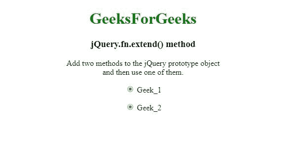
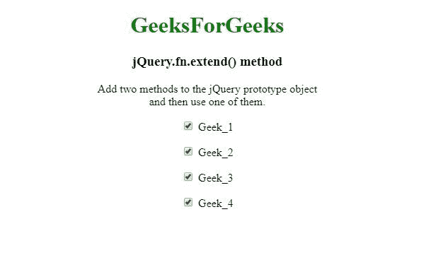

# jQuery.fn.extend()方法

> 原文:[https://www.geeksforgeeks.org/jquery-fn-extend-method/](https://www.geeksforgeeks.org/jquery-fn-extend-method/)

这个 **jQuery.fn.extend()** 方法用于将对象的内容合并到 jQuery 原型上，以提供新的 jQuery 实例方法。

**语法:**

```
jQuery.fn.extend( object )

```

**参数:**该方法接受如上所述的单个参数，描述如下:

*   **对象:**此参数保存要合并到 jQuery 原型上的对象。

**返回值:**合并后返回对象。

下面的例子说明了 jQuery.fn.extend()方法的使用:

**示例 1:** 在本例中， **jQuery.fn.extend()方法**用于向 jQuery 原型对象添加两个方法，然后使用其中一个。

```
<!DOCTYPE html>
<html>

<head>
    <meta charset="utf-8">
    <title>jQuery.fn.extend() method</title>
    <script src=
        "https://code.jquery.com/jquery-3.4.1.js">
    </script>
</head>

<body style="text-align:center;">

    <h1 style="color: green">
        GeeksForGeeks
    </h1>

    <h3>jQuery.fn.extend() method</h3>

    <p>
        Add two methods to the jQuery prototype
        object <br>and then use one of them.
    </p>

    <p><input type="radio" name="Geek_1"> Geek_1</p>

    <p><input type="radio" name="Geek_2"> Geek_2</p>

    <script>
        jQuery.fn.extend({
            Gfg1: function () {
                return this.each(function () {
                    this.checked = true;
                });
            },
            Gfg2: function () {
                return this.each(function () {
                    this.checked = false;
                });
            }
        });

        // Use the newly created .Gfg1() method
        $("input[type='radio']").Gfg1();
    </script>
</body>

</html>
```

**输出:**


**示例 2:** 在本例中， **jQuery.fn.extend()方法**用于将更多的方法合并到 jQuery 原型对象中。

```
<!DOCTYPE html>
<html>

<head>
    <meta charset="utf-8">
    <title>jQuery.fn.extend() method</title>

    <script src=
        "https://code.jquery.com/jquery-3.4.1.js">
    </script>
</head>

<body style="text-align:center;">

    <h1 style="color: green">
        GeeksForGeeks
    </h1>

    <h3>jQuery.fn.extend() method</h3>

    <p>
        Add two methods to the jQuery prototype 
        object <br>and then use one of them.
    </p>

    <p><input type="checkbox" name="Geek_1"> Geek_1</p>
    <p><input type="checkbox" name="Geek_2"> Geek_2</p>
    <p><input type="checkbox" name="Geek_3"> Geek_3</p>
    <p><input type="checkbox" name="Geek_4"> Geek_4</p>

    <script>
        jQuery.fn.extend({
            Gfg1: function () {
                return this.each(function () {
                    this.checked = true;
                });
            },
            Gfg2: function () {
                return this.each(function () {
                    this.checked = false;
                });
            }
        });

        // Use the newly created .Gfg1() method
        $("input[type='checkbox']").Gfg1();
    </script>
</body>

</html>
```

**输出:**
