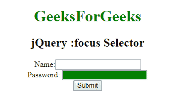

# jQuery |:焦点选择器

> 原文:[https://www.geeksforgeeks.org/jquery-focus-selector/](https://www.geeksforgeeks.org/jquery-focus-selector/)

**:焦点选择器**用于选择当前文档中所有有焦点的元素。它还与一个**标签名称**或**一起使用，使用另一个选择器**。

**语法:**

```html
$(":focus")
```

**示例:**

```html
<!DOCTYPE html>
<html>

<head>
    <script src=
"https://ajax.googleapis.com/ajax/libs/jquery/3.3.1/jquery.min.js">
  </script>

  <script>
        $(document).ready(function() {
            $("input").focus();
            $(":focus").css(
              "background-color", "green");
        });
    </script>
</head>

<body>
    <center>
        <h1 style="color:green;">
          GeeksForGeeks
      </h1>
        <h2> jQuery :focus Selector 
      </h2> Name:
        <input type="text" />
        <br> Password:
        <input type="text" />
        <br>
        <button>Submit
      </button>
  </center>
</body>

</html>
```

**输出:**


**支持的浏览器:**以下是 **jQuery:焦点选择器**支持的浏览器:

*   谷歌 Chrome
*   微软公司出品的 web 浏览器
*   火狐浏览器
*   歌剧
*   旅行队