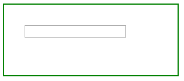
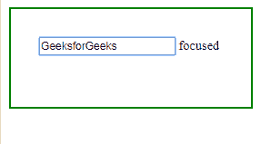
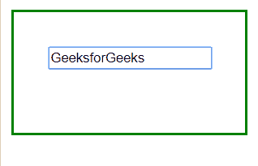

# jQuery | focus()带示例

> 原文:[https://www.geeksforgeeks.org/jquery-focus-with-examples/](https://www.geeksforgeeks.org/jquery-focus-with-examples/)

**focus()** 是 jQuery 中的一个内置方法，用于聚焦一个元素。通过鼠标点击或选项卡导航按钮，元素变得聚焦。
**语法:**

```
$(selector).focus(function)

```

这里选择器是被选择的元素。
**参数:**接受一个可选参数“function”，指定焦点事件发生时要运行的函数。
**返回值:**返回聚焦的选中元素。

<center>**jQuery 代码展示 focus()方法的工作方式:**</center>

**代码#1:**
在下面的代码中，一个函数被传递给这个方法。

```
<html>

<head>
    <style>
        span {
            display: none;
        }

        body {
            width: 35%;
            height: 50px;
            border: 2px solid green;
            padding: 35px;
            margin: 10px;
        }
    </style>
    <script src="https://code.jquery.com/jquery-1.10.2.js">
    </script>
</head>

<body>
    <!-- this paragraph element get focused -->
    <p>
        <input type="text"> <span>focused</span></p>

    <!-- jQuery cdee to show working of this method -->
    <script>
        $("input").focus(function() {
            $(this).next("span").css("display", "inline");
        });
    </script>

</body>

</html>
```

**输出:**
鼠标点击前输入栏内-


鼠标点击后输入栏内有文字【极客头像】-


**代码#2:**
在下面的代码中，没有参数传递给这个方法。

```
<html>

<head>
    <style>
        span {
            display: none;
        }

        body {
            width: 30%;
            height: 50px;
            border: 2px solid green;
            padding: 35px;
            margin: 10px;
        }
    </style>
    <script src="https://code.jquery.com/jquery-1.10.2.js">
    </script>
</head>

<body>
    <!-- this paragraph element get focused -->
    <p>
        <input type="text"> <span>focused</span></p>

    <!-- jQuery code to show working of this method -->
    <script>
        $("input").focus();
    </script>

</body>

</html>
```

**输出:**
在输入区域内点击鼠标之前-


点击鼠标后输入栏内有文字“geeksforgeks”-


jQuery 是一个开源的 JavaScript 库，它简化了 HTML/CSS 文档之间的交互，它以其“少写多做”的理念而闻名。
跟随本 [jQuery 教程](https://www.geeksforgeeks.org/jquery-tutorials/)和 [jQuery 示例](https://www.geeksforgeeks.org/jquery-examples/)可以从头开始学习 jQuery。