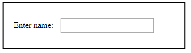
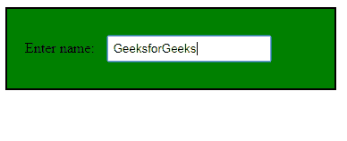
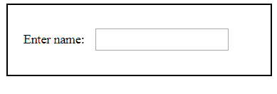
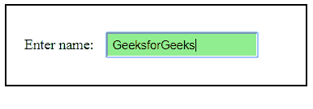

# jQuery | focusin()带示例

> 原文:[https://www.geeksforgeeks.org/jquery-focusin-with-examples/](https://www.geeksforgeeks.org/jquery-focusin-with-examples/)

**focusin()** 是 jQuery 中的一个内置方法，用于获得对所选元素的关注。
**语法:**

```html
$(selector).focusin(function);
```

**参数:**它接受一个可选参数“函数”，该参数获得对所选元素的关注。
**返回值:**返回获得焦点的选中元素。
**jQuery 代码展示 focusin()方法的工作方式:**
**代码#1:**
在下面的代码中，参数函数被传递。

## 超文本标记语言

```html
<html>

<head>
    <script
    src="https://ajax.googleapis.com/ajax/libs/jquery/3.3.1/jquery.min.js">
    </script>
    <!-- jQuery code to show the working of this method -->
    <script>
        $(document).ready(function() {
            $("div").focusin(function() {
                $(this).css("background-color", "green");
            });
        });
    </script>
    <style>
        div {
            border: 2px solid black;
            width: 50%;
            padding: 20px;
        }

        input {
            padding: 5px;
            margin: 10px;
        }
    </style>
</head>

<body>
    <!-- click inside the field focusin will take place -->
    <div>
        Enter name:
        <input type="text">
        <br>
    </div>

</body>

</html>
```

**输出:**
点击输入字段内部前-



点击输入字段内的 focusin 方法后将会生效-



**代码#2:**
在下面的代码中，没有传递任何参数。

## 超文本标记语言

```html
<html>

<head>
    <script
    src="https://ajax.googleapis.com/ajax/libs/jquery/3.3.1/jquery.min.js">
    </script>
    <!-- jQuery code to show the working of this method -->
    <script>
        $(document).ready(function() {
            $("#foc").click(function() {
                $(this).focusin().css("background-color", "lightgreen");
            });
        });
    </script>
    <style>
        div {
            border: 2px solid black;
            width: 50%;
            padding: 20px;
        }

        input {
            padding: 5px;
            margin: 10px;
        }
    </style>
</head>

<body>
    <!-- click inside the field focusin will take place and
    background color becomes change -->
    <div>
        Enter name:
        <input id="foc" type="text">
        <br>
    </div>

</body>

</html>
```

**输出:**
点击输入字段内部前-



点击输入字段内的 focusin 方法后将会生效-

