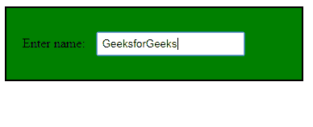

# jQuery | focusout()带示例

> 原文:[https://www.geeksforgeeks.org/jquery-focusout-with-example/](https://www.geeksforgeeks.org/jquery-focusout-with-example/)

**focusout()** 是 jQuery 中的一个内置方法，用于移除所选元素的焦点。
**语法:**

```html
$(selector).focusout(function);

```

**参数:**接受一个参数“函数”，在淡出方法执行后执行。
**返回值:**返回失去焦点的选中元素。
**jQuery 代码显示 focusout()方法的工作方式:**

```html
<html>

<head>
    <script 
    src="https://ajax.googleapis.com/ajax/libs/jquery/3.3.1/jquery.min.js">
    </script>
    <!-- jQuery code to show the working of this method -->
    <script>
        $(document).ready(function() {
            $("div").focusin(function() {
                $(this).css("background-color", "green");
            });
            $("div").focusout(function() {
                $(this).css("background-color", "#FFFFFF");
            });
        });
    </script>
    <style>
        div {
            border: 2px solid black;
            width: 50%;
            padding: 20px;
        }

        input {
            padding: 5px;
            margin: 10px;
        }
    </style>
</head>

<body>
    <!-- click inside the field focusin will take place and when 
                      click outside focusout will take place -->
    <div>
        Enter name:
        <input type="text">
        <br>
    </div>

</body>

</html>
```

**输出:**
点击输入栏内的 focusin 后会生效-


点击输入域外后，聚焦输出将会生效。
