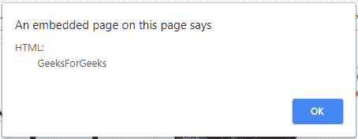

# jQuery |获取内容和属性

> 原文:[https://www . geesforgeks . org/jquery-get-content-and-attributes/](https://www.geeksforgeeks.org/jquery-get-content-and-attributes/)

**获取内容:**为了获取 DOM 对象的内容，有三种简单的方法，下面列出了 DOM 操作的 jQuery 方法:

*   **text():** 用于设置或返回选中元素的文本内容。
*   **html():** 用于设置或返回包括 html 标记在内的选中元素的内容。
*   **val():** 用于设置或返回表单域的值。

**示例:**本示例使用文本内容方法获取内容。

```html
<!DOCTYPE html>
<html>

<head> 
    <title>jQuery Get Content</title>

    <script src=
"https://ajax.googleapis.com/ajax/libs/jquery/3.3.1/jquery.min.js">
    </script>
</head> 

<body style="text-align:center;">

    <h1 id="GFG1" style = "color:green;">
        GeeksForGeeks
    </h1>

    <h2 id="GFG2">jQuery Get Content</h2>

    <button id="btn1">Text</button>
    <button id="btn2">HTML</button>

    <!-- Script to get the content -->
    <script>
        $(document).ready(function(){
            $("#btn1").click(function(){
                alert("Text: " + $("#GFG2").text());
            });

            $("#btn2").click(function(){
                alert("HTML: " + $("#GFG1").html());
            });
        });
    </script>
</body>

</html>  
```

**输出:**

*   **之前点击按钮:**
    
*   **点击【文本】按钮后:**
    
*   **点击 Html 按钮后:**
    

**获取属性****jQuery attr()方法**用于获取 DOM 对象的属性值。

**示例:**本示例使用 attr()方法获取属性值。

```html
<!DOCTYPE html>
<html>

<head> 
    <title>jQuery Get Attributes</title>

    <script src=
"https://ajax.googleapis.com/ajax/libs/jquery/3.3.1/jquery.min.js">
    </script>
</head> 

<body style="text-align:center;">

    <h1 style = "color:green;">
        GeeksForGeeks
    </h1>

    <h2>jQuery Get Attributes</h2>

    <button id="btn1">Click</button>

    <br><br>

    <h3>
        <a href="https://geeksforgeeks.org" id="GFG">
            geeksforgeeks.org
        </a>
    </h3>

    <!-- Script to get the attribute value -->
    <script>
        $(document).ready(function(){
            $("button").click(function(){
                alert($("#GFG").attr("href"));
            });
        });
    </script>
</body>

</html>  
```

**输出:**

*   **之前点击按钮:**
    
*   **点击按钮后:**
    