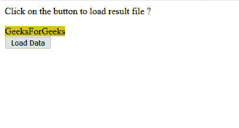
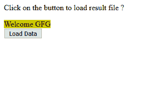

# jQuery | get()方法

> 原文:[https://www.geeksforgeeks.org/jquery-get-method/](https://www.geeksforgeeks.org/jquery-get-method/)

在 **jQuery 中。get()方法**通过使用 **GET HTTP 请求**从服务器加载数据。该方法返回 **XMLHttpRequest** 对象。

**语法**

```html
$.get( url, [data], [callback], [type] )

```

**参数**

1.  **url :** 包含发送请求的 url 的字符串
2.  **数据:**这是一个可选参数，表示将发送到服务器的键/值对。
3.  **回调:**该可选参数表示每当数据加载成功时要执行的功能。
4.  **类型:**此参数表示要返回给回调函数的数据类型，即“xml”、“脚本”、“json”、“html”、“html”、“jsonp”或“文本”。

**示例:**

*   This PHP code is use to get data when below html program send the HTTP GET request.

    ```html
    // Result.php file
    <?php
    if( $_REQUEST["name"] ) {

       $name = $_REQUEST['name'];
       echo "Welcome ". $name;
    }

    ?>
    ```

    *   This HTML code is use to send the HTTP GET request.

    ```html
    <html>

    <head>
        <script type="text/javascript"
                src=
    "https://ajax.googleapis.com/ajax/libs/jquery/2.1.3/jquery.min.js">
      </script>

        <script type="text/javascript"
                language="javascript">
            $(document).ready(function() {

            $("#driver").click(function(event) {
                    $.get(
                     "result.php", {
                         name: "GFG"
                     },
                     function(data) {
                         $('#stage').html(data);
                     });
                });
            });
        </script>
    </head>

    <body>
        <p>Click on the button to load result file 
      </p>

        <span id="stage" 
              style="background-color:#cc0;">
             GeeksForGeeks
          </span>

        <div>
            <input type="button"
                   id="driver"
                   value="Load Data" />
        </div>

    </body>

    </html>
    ```

    **输出:**
    **点击按钮前:**
    

    **点击按钮后:**
    