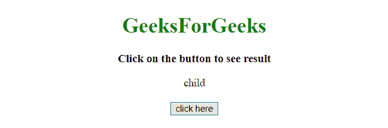
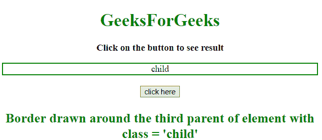
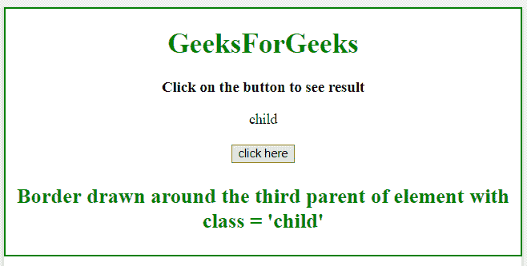

# JQuery |获取元素的第 n 级父元素

> 原文:[https://www . geesforgeks . org/jquery-get-the-n-level-parent-of-element/](https://www.geeksforgeeks.org/jquery-get-the-n-th-level-parent-of-an-element/)

给定 DOM 中的一个元素，任务是使用 JQuery 找到该元素的第 n 级父元素。下面讨论几个方法:

*   **[jQuery on() Method](https://www.geeksforgeeks.org/jquery-on-with-examples/):**
    This method adds one or more event handlers for the selected elements and child elements.

    **语法:**

    ```html
    $(selector).on(event, childSel, data, fun, map)

    ```

    **参数:**

    *   **事件:**此参数为必填项。它指定要添加到选定元素的一个或多个事件或命名空间。
        如果有多个事件值，用空格隔开。事件必须是有效的。
    *   **儿童选择:**该参数为可选参数。它指定事件处理程序应该只附加到已定义的子元素。
    *   **数据:**此参数为可选。它指定要传递给函数的附加数据。
    *   **乐趣:**这个参数是必须的。它指定事件发生时要运行的函数。
    *   **映射:**它指定了一个事件映射({event:func()，event:func()，…})，该事件映射有一个或多个要添加到所选元素的事件，以及事件发生时要运行的函数。
*   **[jQuery parents() Method](https://www.geeksforgeeks.org/jquery-parent-parents-with-examples/):**
    This is an inbuilt method in jQuery and is used to find the all parent elements related to the selected element. This method traverse all the levels up the selected element and return that all elements.

    **语法:**

    ```html
    $(selector).parents()

    ```

    **返回值:**
    返回所选元素的所有父元素。

*   **[jQuery eq() Method](https://www.geeksforgeeks.org/jquery-eq-with-examples/):**
    This method returns an element with a passed index number of the matched elements.
    The index start from 0.

    **语法:**

    ```html
    $(selector).eq(index)

    ```

    **参数:**

    *   **索引:**此参数为必选项。它指定元素的索引。接受正数或负数。

**示例 1:** 本示例使用 **parents()** 和 **eq()** 方法来查找 *class='child'* 元素的第 0 级父元素，该元素是 **< div >** 元素。

```html
<!DOCTYPE HTML>
<html>

<head>
    <title>
        JQuery | Get the n-th level parent of an element.
    </title>
</head>
<script src=
"https://ajax.googleapis.com/ajax/libs/jquery/3.4.0/jquery.min.js">
</script>

<body style="text-align:center;" id="body">
    <h1 style="color:green;">  
            GeeksForGeeks  
        </h1>
    <p id="GFG_UP" 
       style="font-size: 17px; font-weight: bold;">
    </p>
    <div class="parent">
        <div class="child">
            child
        </div>
    </div>
    <br>
    <button>
        click here
    </button>
    <p id="GFG_DOWN" 
       style="color: green;
              font-size: 24px;
              font-weight: bold;">
    </p>
    <script>
        $('#GFG_UP').text('Click on the button to see result');
        $('button').on('click', function() {
            $('.child').parents().eq(0).css({
                "color": "green",
                "border": "2px solid green"
            });
            $('#GFG_DOWN').text(
              "Border drawn around the first parent "+
              "of element with class = 'child'");
        });
    </script>
</body>

</html>
```

**输出:**

*   **点击按钮前:**
    
*   **点击按钮后:**
    

**例 2:** 本例使用 **parents()** 和 **eq()方法**找到 *class='child'* 元素的第二级父元素，它是 **< body >** 元素。

```html
<!DOCTYPE HTML>
<html>

<head>
    <title>
        JQuery| Get the n-th level parent of an element.
    </title>
</head>
<script src=
"https://ajax.googleapis.com/ajax/libs/jquery/3.4.0/jquery.min.js">
</script>

<body style="text-align:center;" id="body">
    <h1 style="color:green;">  
            GeeksForGeeks  
        </h1>
    <p id="GFG_UP"
       style="font-size: 17px; font-weight: bold;">
    </p>
    <div class="parent">
        <div class="child">
            child
        </div>
    </div>
    <br>
    <button>
        click here
    </button>
    <p id="GFG_DOWN" 
       style="color: green; 
              font-size: 24px;
              font-weight: bold;">
    </p>
    <script>
        $('#GFG_UP').text('Click on the button to see result');
        $('button').on('click', function() {
            $('.child').parents().eq(2).css({
                "border": "2px solid green"
            });
            $('#GFG_DOWN').text(
              "Border drawn around the third parent "+
              "of element with class = 'child'");
        });
    </script>
</body>

</html>
```

**输出:**

*   **点击按钮前:**
    
*   **点击按钮后:**
    