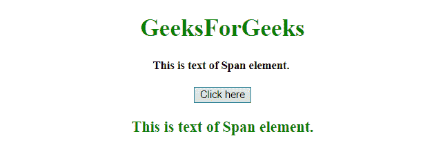

# JQuery |获取跨度元素的文本

> 原文:[https://www . geesforgeks . org/jquery-get-the-text-of-span-element/](https://www.geeksforgeeks.org/jquery-get-the-text-of-a-span-element/)

给定一个 HTML 文档，任务是使用 JQuery 获取一个标签的文本。

**方法 1:使用 [jQuery text()方法](https://www.geeksforgeeks.org/jquery-text-method/) :** 此方法用于设置或返回指定元素的文本内容。如果使用此方法返回内容，它将返回所有匹配元素的文本内容(HTML 标记将被移除)。如果此方法用于设置内容，它将覆盖所有匹配元素的内容。

**语法:**

*   **返回文字内容:**

```html
$(selector).text()

```

*   **设置文字内容:**

    ```html
    $(selector).text(content)

    ```

    *   **Set text content using a function:**

    ```html
    $(selector).text(function(index, curContent))

    ```

    **参数:**

    *   **内容:**必输参数。它为选定的元素指定新的文本内容。
    *   **函数(index，curContent):** 为可选参数。它指定为选定元素返回新文本内容的函数。
        *   **索引:**返回元素在集合中的索引位置。
        *   **curContent:** 返回当前选中元素的内容。

    **示例:**本示例使用 **JQuery 的 text()方法**获取内容。

    ```html
    <!DOCTYPE HTML> 
    <html> 
        <head> 
            <title> 
                JQuery | Get the text of a span element
            </title>

            <script src = 
    "https://ajax.googleapis.com/ajax/libs/jquery/3.4.0/jquery.min.js">
            </script>
        </head> 

        <body style = "text-align:center;" id = "body"> 

            <h1 style = "color:green;" > 
                GeeksForGeeks 
            </h1> 

            <span id="GFG_Span" style = "font-size: 15px; font-weight: bold;">
                This is text of Span element. 
            </span>

            <br><br>

            <button> 
                Click Here
            </button>

            <p id="GFG_DOWN" style="color:green;font-size:20px;font-weight:bold;">
            </p>

            <script>
                $('button').on('click', function() {
                    var $val = $('#GFG_Span').text();
                    $('#GFG_DOWN').text($val);
                });     
            </script> 
        </body> 
    </html>                    
    ```

    **输出:**

    *   **点击按钮前:**
        
    *   **点击按钮后:**
        

    **方法二:使用 [jQuery html()方法](https://www.geeksforgeeks.org/jquery-html-method/) :** 该方法设置或返回指定元素的内容(html)。如果此方法用于返回内容，它将返回第一个匹配元素的内容。如果此方法用于设置内容，它将覆盖所有匹配元素的内容。

    **语法:**

    *   **返回内容:**

        ```html
        $(selector).html()

        ```

    *   **设置内容:**

        ```html
        $(selector).html(content)

        ```

    *   **使用功能设置内容:**

        ```html
        $(selector).html(function(index, curContent))

        ```

    **参数:**

    *   **内容:**此参数为必填项。它为包含 HTML 标记的选定元素指定新的文本内容。
    *   **功能(索引，curContent):** 此参数可选。它指定了一个函数，该函数返回所选元素的新内容。
        *   **索引:**返回元素在集合中的索引位置。
        *   **curContent:** 返回当前选中元素的 HTML 内容。

    **示例:**本示例使用 **JQuery 的 html()方法**获取内容。

    ```html
    <!DOCTYPE HTML> 
    <html> 
        <head> 
            <title> 
                JQuery | Get the text of a span element.
            </title>
            <script src = 
    "https://ajax.googleapis.com/ajax/libs/jquery/3.4.0/jquery.min.js">
            </script>
        </head> 

        <body style = "text-align:center;" id = "body"> 

            <h1 style = "color:green;" > 
                GeeksForGeeks 
            </h1> 

            <span id="GFG_Span" style="font-size:15px; font-weight:bold;">
                This is text of Span element. 
            </span>

            <br><br>

            <button> 
                Click Here
            </button>

            <p id="GFG_DOWN" style="color:green; font-size:20px; font-weight:bold;">
            </p>

            <script>
                $('button').on('click', function() {
                    var $val = $('#GFG_Span').html();
                    $('#GFG_DOWN').text($val);
                });     
            </script> 
        </body> 
    </html>                    
    ```

    **输出:**

    *   **点击按钮前:**
        
    *   **点击按钮后:**
        

    jQuery 是一个开源的 JavaScript 库，它简化了 HTML/CSS 文档之间的交互，它以其“少写多做”的理念而闻名。
    跟随本 [jQuery 教程](https://www.geeksforgeeks.org/jquery-tutorials/)和 [jQuery 示例](https://www.geeksforgeeks.org/jquery-examples/)可以从头开始学习 jQuery。