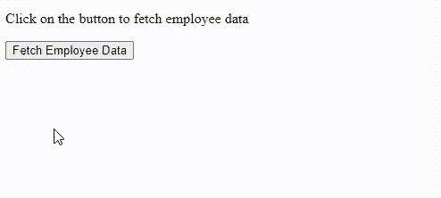

# jQuery getJSON()方法

> 原文:[https://www.geeksforgeeks.org/jquery-getjson-method/](https://www.geeksforgeeks.org/jquery-getjson-method/)

在本文中，我们将学习 jQuery 中的 **getJSON()方法**，并通过示例了解它们的实现。jQuery 是一个开源的 JavaScript 库，它简化了 HTML/CSS 文档之间的交互，它以**“少写多做”**的理念而闻名。

jQuery 中的 **getJSON()方法**使用 GET HTTP 请求从服务器获取 JSON 编码的数据。

**语法:**

```html
$(selector).getJSON(url,data,success(data,status,xhr))
```

**参数:**该方法接受三个参数，如上所述，如下所述:

*   **url:** 必选参数。它用于以字符串的形式指定请求发送到的 URL
*   **数据:**是一个可选参数，指定将发送到服务器的数据。
*   **回调:**也是请求成功时运行的可选参数。

**返回值:**返回 XMLHttpRequest 对象。

详情请参考 [jQuery 教程](https://www.geeksforgeeks.org/jquery-tutorials/)和 [jQuery 示例](https://www.geeksforgeeks.org/jquery-examples/)文章。

**示例:**下面的示例说明了 jQuery 中的 **getJSON()** 方法。

**employee.json 文件:**

> {
> 【姓名】:【托尼·斯塔克】、
> 【年龄】:【53】、
> 【角色】:【Techincal 内容作者】、
> 【公司】:【极客为极客】
> }

在这里，我们获取 JSON 文件并显示其内容。

## 超文本标记语言

```html
<!DOCTYPE html>
<html>

<head>
    <title>jQuery getJSON() Method</title>
    <script src=
"https://ajax.googleapis.com/ajax/libs/jquery/3.3.1/jquery.min.js">
    </script>

    <!-- Script to get JSON file and display its content -->
    <script type="text/javascript" language="javascript">
    $(document).ready(function() {
        $("#fetch").click(function(event) {
            $.getJSON('employee.json', function(emp) {
                $('#display').html('<p> Name: ' + emp.name + '</p>');
                $('#display').append('<p>Age : ' + emp.age + '</p>');
                $('#display').append('<p> Role: ' + emp.role + '</p>');
                $('#display').append('<p> Company: '
                + emp.company 
                + '</p>');
            });
        });
    });
    </script>
</head>

<body>

<p> Click on the button to fetch employee data </p>

    <div id="display" style="background-color:#39B54A;"></div>
    <input type="button" id="fetch" value="Fetch Employee Data" /> </body>

</html>
```

**输出:**



getJSON()方法