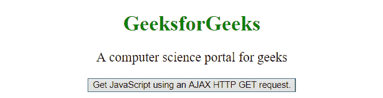
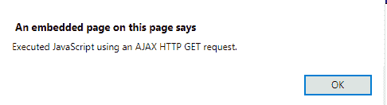
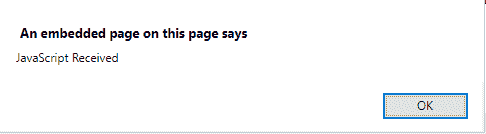

# jQuery | getScript()方法

> 原文:[https://www.geeksforgeeks.org/jquery-getscript-method/](https://www.geeksforgeeks.org/jquery-getscript-method/)

jQuery 中的 **getScript()方法**用于使用 **AJAX HTTP GET 请求**运行一个 JavaScript。

**语法:**

```html
$(selector).getScript(url, success(response, status))
```

**参数:**包含两个参数，如上所述，描述如下:

*   **url:** 必输参数。它持有请求发送到的 **url** 。
*   **成功(响应，状态):**可选参数。如果请求成功，它保存要运行的函数。
    *   **响应:**保存请求的结果数据。
    *   **状态:**它保存请求的状态，如-“成功”、“未修改”、“错误”、“超时”或“解析错误”。

存储在服务器上的 **test.js** 文件，点击**更改内容**按钮后加载。

> **test.js**
> 警报(“使用 AJAX 获取 javaScript HTTP Get 请求”)；

**示例 1:** 本示例显示了来自 AJAX HTTP GET 请求接收到的 JavaScript 的警报消息。

```html
<!DOCTYPE html> 
<html> 
    <head> 
        <script src= 
"https://ajax.googleapis.com/ajax/libs/jquery/3.3.1/jquery.min.js"> 
        </script> 

        <script> 
            $(document).ready(function() {
                $("button").click(function() {
                    $.getScript("test.js");
                });
            });
        </script> 
    </head> 

    <body style="text-align:center;"> 

        <h1 style = "color: green;">GeeksforGeeks</h1> 

        <p id = "paragraph" style= "font-size: 20px;">
            A computer science portal for geeks
        </p> 

        <button>
            Get JavaScript using an AJAX HTTP GET request.
        </button> 
    </body> 
</html>                    
```

**输出:**

*   **之前点击按钮:**
    
*   **点击按钮后:**
    

**示例 2:** 本示例使用 getScript()方法显示警报消息。

```html
<!DOCTYPE html> 
<html> 
    <head> 
        <script src= 
"https://ajax.googleapis.com/ajax/libs/jquery/3.3.1/jquery.min.js"> 
        </script> 

        <!-- Script to use getScript() Method -->
        <script> 
            $(document).ready(function(){
                $("button").click(function(){
                    $.getScript("test.js", alert("JavaScript Received "));
                });
            });
        </script> 
    </head> 

    <body style="text-align:center;"> 

        <h1 style = "color: green;">GeeksforGeeks</h1> 

        <p id = "paragraph" style= "font-size: 20px;">
            A computer science portal for geeks
        </p> 

        <button>
            Get JavaScript using an AJAX HTTP GET request.
        </button> 
    </body> 
</html>                    
```

**输出:**

*   **之前点击**
    按钮
*   **点击**
    
    按钮后