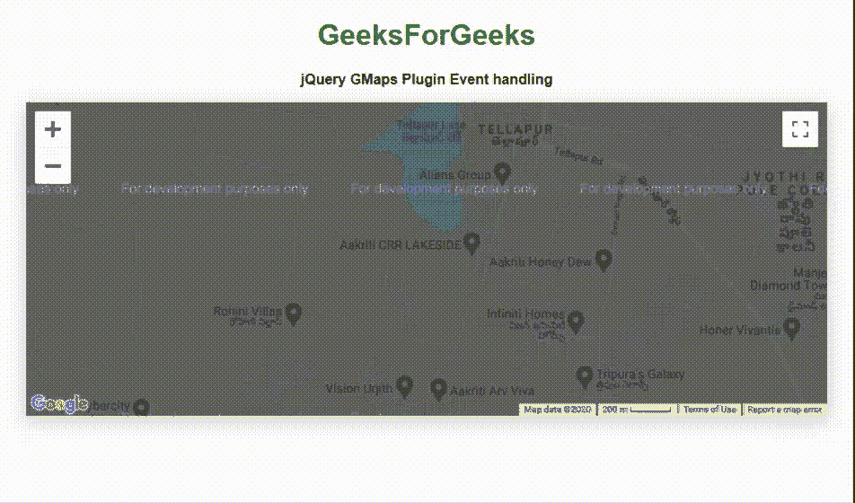

# jQuery GMaps 插件

> 哎哎哎:# t0]https://www . geeksforgeeks . org/jquery-gmaps 插件/

jQuery 提供了 **GMaps** 插件，帮助程序员以多种方式使用**谷歌地图**。您必须在工作文件夹中下载所需的文件，以便程序员可以在 HTML 结构页面的标题部分中包含以下程序中实现的内容。

**jQuery GMaps 插件下载链接:**https://hpneo . dev/Gmail/

在下面的例子中，我们使用了一个有效的现有位置的纬度和经度，这可以通过从下面的链接在输入控制框中输入一个位置地址来获得。请记下用户输入地址的纬度和经度，以便在代码中进一步操作。

> https://www.latlong.net/

**示例 1:** 以下示例演示了基于经纬度值的 **GMaps** 插件的基本调用，以显示地图中的位置。

## 超文本标记语言

```html
<!DOCTYPE html>
<html>
    <head>
        <meta charset="utf-8" />
        <title>jQuery GMaps Plugin</title>

        <script type="text/javascript" src=
"http://ajax.googleapis.com/ajax/libs/jquery/1.6.4/jquery.min.js">
        </script>
        <script type="text/javascript" src=
"http://maps.google.com/maps/api/js?sensor=true">
         </script>
        <script type="text/javascript" src="gmaps.js"></script>

        <link rel="stylesheet" href=
 "http://twitter.github.com/bootstrap/1.3.0/bootstrap.min.css" />
        <link rel="stylesheet" type="text/css" href="examples.css" />

        <style>
            body {
                text-align: center;
            }
        </style>
        <script type="text/javascript">
            var map;
            $(document).ready(function () {
                map = new GMaps({
                    el: "#map",
                    lat: 21.164904,
                    lng: 81.324297,
                    zoomControl: true,
                    zoomControlOpt: {
                        style: "SMALL",
                        position: "BOTTOM_LEFT",
                    },
                    panControl: true,
                    streetViewControl: true,
                    mapTypeControl: true,
                });
            });
        </script>
    </head>
    <body>
        <h1 style="color: green;">GeeksForGeeks</h1>
        <b>jQuery GMaps Plugin</b>

<p></p>

        <div class="row">
            <div class="span11">
                <div id="map"></div>
            </div>
        </div>
    </body>
</html>
```

**输出:**


**示例 2:** 以下程序使用 **GMap** 插件在输入位置周围画圆。

## 超文本标记语言

```html
<!DOCTYPE html>
<html>
    <head>
        <meta charset="utf-8" />
        <title>jQuery GMaps Plugin</title>
        <script type="text/javascript" src=
 "http://ajax.googleapis.com/ajax/libs/jquery/1.6.4/jquery.min.js">
        </script>
        <script type="text/javascript" src=
"http://maps.google.com/maps/api/js?sensor=true"></script>
        <script type="text/javascript" src="gmaps.js"></script>
        <link rel="stylesheet" href=
"http://twitter.github.com/bootstrap/1.3.0/bootstrap.min.css" />
        <link rel="stylesheet" type="text/css" href="examples.css" />

        <style>
            body {
                text-align: center;
            }
        </style>
        <script type="text/javascript">
            var map;

            $(document).ready(function () {
                map = new GMaps({
                    el: "#map",
                    lat: 17.4574683,
                    lng: 78.2822645,
                });

                var latitude = 17.4574683;
                var longitude = 78.2822645;

                circle = map.drawCircle({
                    lat: latitude,
                    lng: longitude,
                    radius: 451,
                    strokeColor: "#33FFAF",
                    strokeOpacity: 1,
                    strokeWeight: 4,
                    fillColor: "#33FFAF",
                    fillOpacity: 0.5,
                });

                for (var i in paths) {
                    bounds.push(paths[i]);
                }
                var arrayVar = [];
                for (var i in bounds) {
                    latitudeLongitude =
                      new google.maps.LatLng(bounds[i][0], bounds[i][1]);
                    arrayVar.push(latitudeLongitude);
                }
                for (var i in paths) {
                    latitudeLongitude =
                      new google.maps.LatLng(paths[i][0], paths[i][1]);
                    arrayVar.push(latitudeLongitude);
                }
                map.fitLatLngBounds(arrayVar);
            });
        </script>
    </head>
    <body>
        <h1 style="color: green;">GeeksForGeeks</h1>
        <b>Draw circle using GMaps Plugin</b>

<p></p>

        <div class="row">
            <div class="span11">
                <div id="map"></div>
            </div>
        </div>
    </body>
</html>
```

**输出:**


**示例 3:** 以下程序演示了插件的事件处理功能。它在*点击*和*拖动*事件上显示消息。

## 超文本标记语言

```html
<!DOCTYPE html>
<html>
    <head>
        <meta charset="utf-8" />
        <title>jQuery GMaps Plugin Event handling</title>
        <script type="text/javascript" src=
 "http://ajax.googleapis.com/ajax/libs/jquery/1.6.4/jquery.min.js">
        </script>
        <script type="text/javascript" src=
 "http://maps.google.com/maps/api/js?sensor=true"></script>
        <script type="text/javascript" src="gmaps.js"></script>
        <link rel="stylesheet" href=
"http://twitter.github.com/bootstrap/1.3.0/bootstrap.min.css" />
        <link rel="stylesheet" type="text/css" href="examples.css" />

        <style>
            body {
                text-align: center;
            }

            .eventClass {
                width: 90%;
                text-align: center;
                font-weight: bold;
                padding: 10px;
                box-sizing: content-box;
            }
        </style>
        <script type="text/javascript">
            var map;

            $(document).ready(function () {
                map = new GMaps({
                    el: "#map",
                    zoom: 15,
                    lat: 17.4574683,
                    lng: 78.2822645,
                    click: function (e) {
                        var info = "Click event occured!";
                        $("#ClickEventDivID").text(info);
                    },
                    dragend: function (e) {
                        var info = "User dragged a location !";
                        $("#DragEventDivID").text(info);
                    },
                });
            });
        </script>
    </head>
    <body>
        <h1 style="color: green;">GeeksForGeeks</h1>
        <b>jQuery GMaps Plugin Event handling </b>

<p></p>

        <div class="row">
            <div class="span11">
                <div id="map"></div>
            </div>
        </div>
        <br />
        <br />
        <div id="ClickEventDivID" class="eventClass"></div>
        <div id="DragEventDivID" class="eventClass"></div>
    </body>
</html>
```

**输出:**



**示例 4:** 以下示例演示了 **GMap** 插件的*开放街道地图*地图类型。

## 超文本标记语言

```html
<!DOCTYPE html>
<html>
    <head>
        <meta charset="utf-8" />
        <title>jQuery GMaps Plugins Map Types</title>
        <script type="text/javascript" src=
 "http://ajax.googleapis.com/ajax/libs/jquery/1.6.4/jquery.min.js">
        </script>
        <script type="text/javascript" src=
 "http://maps.google.com/maps/api/js?sensor=true"></script>
        <script type="text/javascript" src="gmaps.js"></script>

        <link rel="stylesheet" href=
"http://twitter.github.com/bootstrap/1.3.0/bootstrap.min.css" />
        <link rel="stylesheet" type="text/css" href="examples.css" />
        <style>
            body {
                text-align: center;
            }
        </style>
        <script type="text/javascript">
            var map;
            $(document).ready(function () {
                map = new GMaps({
                    el: "#map",
                    lat: 17.47514,
                    lng: 78.3003,
                    mapTypeControlOptions: {
                        mapTypeIds: ["hybrid", "roadmap", "satellite",
                                               "terrain", "osm", "cloudmade"],
                    },
                });

                map.addMapType("osm", {
                    getTileUrl: function (coord, zoom) {
                        return "http://tile.openstreetmap.org/"
                          + zoom + "/" + coord.x + "/" + coord.y + ".png";
                    },
                    tileSize: new google.maps.Size(256, 256),
                    name: "OpenStreetMap",
                    maxZoom: 15,
                });

                map.setMapTypeId("osm");
            });
        </script>
    </head>
    <body>
        <h1 style="color: green;">GeeksForGeeks</h1>
        <b>jQuery GMaps Plugin Open Street Map </b>

<p></p>

        <div class="row">
            <div class="span11">
                <div id="map"></div>
            </div>
        </div>
    </body>
</html>
```

**输出:**


**示例 5:** 以下示例演示了向输出图像中显示的地图位置添加图层。

## 超文本标记语言

```html
<!DOCTYPE html>
<html>
    <head>
        <meta charset="utf-8" />
        <title>jQuery GMaps Layers Maps</title>
        <script src=
"http://ajax.googleapis.com/ajax/libs/jquery/1.7.1/jquery.min.js">
        </script>
        <script src=
"http://maps.google.com/maps/api/js?sensor=true&libraries=weather">
        </script>
        <script src="gmaps.js"></script>
        <link rel="stylesheet" href=
"http://twitter.github.com/bootstrap/1.3.0/bootstrap.min.css" />
        <link rel="stylesheet" type="text/css" href="examples.css" />
        <style>
            body {
                text-align: center;
            }
        </style>

        <script type="text/javascript">
            var map;

            $(function () {
                map = new GMaps({
                    el: "#map",
                    lat: 17.4574683,
                    lng: 78.2822645,
                    zoom: 3,
                });

                map.addLayer("weather", {
                    clickable: true,
                });

                map.addLayer("traffic");
            });
        </script>
    </head>
    <body>
        <h1 style="green">GeeksForGeeks</h1>
        <b>jQuery GMaps Adding layers Feature</b>

<p></p>

        <div class="row">
            <div class="span11">
                <div id="map"></div>
            </div>
        </div>
    </body>
</html>
```