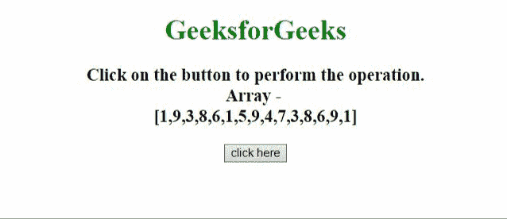
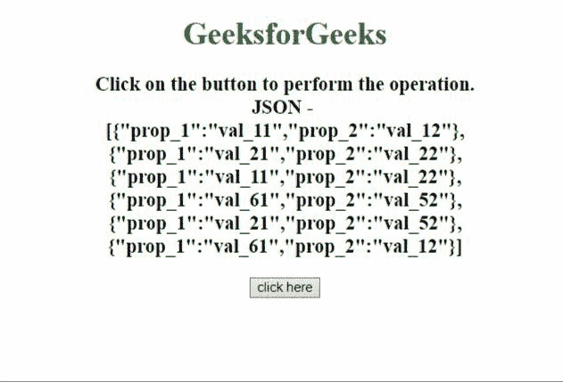

# jQuery | grep()方法

> 原文:[https://www.geeksforgeeks.org/jquery-grep-method/](https://www.geeksforgeeks.org/jquery-grep-method/)

jQuery 中的 grep()方法用于查找满足筛选函数的数组元素。

**语法:**

```html
jQuery.grep(array, function(element, index) [, invert])

```

**参数:**该方法接受两个参数，如上所述，如下所述:

*   **数组:**此参数保存用于搜索的类数组对象。
*   **函数(元素，索引):**它是采用两个参数的过滤函数，**元素**保存数组的元素，**索引**保存该特定元素的索引。
*   **反转:**如果为假或未通过，则函数返回一个数组，该数组包含“回调”返回真的所有元素。如果传递的是 true，则函数返回一个数组，该数组包含“回调”返回 false 的所有元素。

**返回值:**返回满足过滤功能的元素。

**示例 1:** 在本例中， **grep()方法**应用于数字数组，根据条件过滤一些数字。不影响原数组。

```html
<!DOCTYPE html> 
<html>

<head> 
    <title> 
        JQuery | grep() method
    </title>

    <script src=
"https://ajax.googleapis.com/ajax/libs/jquery/3.4.1/jquery.min.js">
    </script>
</head>

<body style="text-align:center;"> 

    <h1 style="color:green;"> 
        GeeksforGeeks 
    </h1> 

    <p id="GFG_UP" style =
        "font-size: 20px; font-weight: bold"> 
    </p>

    <button onclick = "GFG_Fun();"> 
        click here 
    </button> 

    <p id="GFG_DOWN" style = "font-size: 26px;
            font-weight: bold; color: green;"> 
    </p> 

    <script> 
        var up = document.getElementById('GFG_UP');
        var down = document.getElementById('GFG_DOWN');

        var arr = [ 1, 9, 3, 8, 6, 1, 5, 9,
                    4, 7, 3, 8, 6, 9, 1 ];

        up.innerHTML = "Click on the button to "
                + "perform the operation.<br>"
                + "Array - <br>[" + arr + "]";

        function GFG_Fun() {
            var d = $.grep(arr, function( n, i ) {
                return ( n !== 7 && i > 4 );
            });

            down.innerHTML = JSON.stringify(d);
        } 
    </script> 
</body> 

</html>
```

**输出:**


**示例 2:** 在本例中， **grep()方法**应用于 JavaScript 对象数组，根据条件过滤掉一些对象。这个方法不影响原始数组。

```html
<!DOCTYPE html> 
<html>

<head> 
    <title> 
        JQuery | grep() method
    </title>

    <script src=
"https://ajax.googleapis.com/ajax/libs/jquery/3.4.1/jquery.min.js"> 
    </script>
</head>

<body style="text-align:center;"> 

    <h1 style="color:green;"> 
        GeeksforGeeks 
    </h1> 

    <p id="GFG_UP" style=
        "font-size: 20px; font-weight: bold"> 
    </p>

    <button onclick = "GFG_Fun();"> 
        click here 
    </button>

    <p id="GFG_DOWN" style="font-size: 26px;
        font-weight: bold; color: green;"> 
    </p> 

    <script> 
        var up = document.getElementById('GFG_UP');
        var down = document.getElementById('GFG_DOWN');

        var data = [
            {"prop_1":"val_11", "prop_2":"val_12"},
            {"prop_1":"val_21", "prop_2":"val_22"},
            {"prop_1":"val_11", "prop_2":"val_22"},
            {"prop_1":"val_61", "prop_2":"val_52"},
            {"prop_1":"val_21", "prop_2":"val_52"},
            {"prop_1":"val_61", "prop_2":"val_12"}
        ];

        up.innerHTML = "Click on the button to "
                + "perform the operation.<br>"
                + "JSON - <br>" + JSON.stringify(data);

        function GFG_Fun() {
            var d = $.grep(data, function(n, i){
                return n.prop_1==='val_11';
            });

            down.innerHTML=JSON.stringify(d);
        } 
    </script> 
</body>

</html>
```

**输出:**
