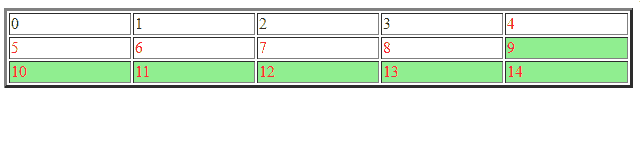

# jQuery | :gt()选择器

> 原文:[https://www.geeksforgeeks.org/jquery-gt-selector/](https://www.geeksforgeeks.org/jquery-gt-selector/)

**jQuery :gt()选择器**选择索引大于匹配集合中提到的索引的所有元素。
**语法:**

```
$(":gt(Index)")
```

**参数:**

*   **索引:**选择的索引号。选择大于指定索引号的元素。

**示例:**

```
<!DOCTYPE html>
<html>

<head>
    <meta charset="utf-8">
    <title>GT</title>
    <script src=
     "https://code.jquery.com/jquery-1.10.2.js">
  </script>
</head>

<body>

    <table style="width:100%" border="3">
        <tr>
            <td>0</td>
            <td>1</td>
            <td>2</td>
            <td>3</td>
            <td>4</td>
        </tr>
        <tr>
            <td>5</td>
            <td>6</td>
            <td>7</td>
            <td>8</td>
            <td>9</td>
        </tr>
        <tr>
            <td>10</td>
            <td>11</td>
            <td>12</td>
            <td>13</td>
            <td>14</td>
        </tr>
    </table>

    <script>
        $("td:gt(8)").css(
          "backgroundColor", "lightgreen");

        $("td:gt(3)").css(
          "color", "red");
    </script>

</body>

</html>
```

**输出:**
