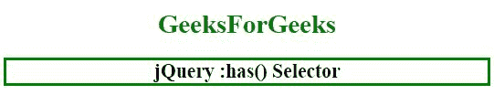
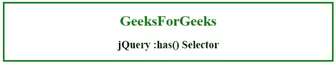

# jQuery |:有()选择器，示例

> 原文:[https://www . geesforgeks . org/jquery-has-selector-with-example/](https://www.geeksforgeeks.org/jquery-has-selector-with-example/)

jQuery 中的 **:has()选择器**用于选择所有内部有一个或多个元素的元素，与指定的选择器匹配。

**语法:**

```
$(":has(selector)")
```

**参数:**该选择器包含单参数**选择器**，该选择器是强制性的，用于指定要选择的元素。它还需要接受任何类型的选择器。

**示例 1:** 本示例使用:has 选择器选择< h2 >跨度元素来创建实心绿色边框。

```
<!DOCTYPE html>
<html>
   <head>
      <title>jQuery :has() Selector</title>

      <script src=
"https://ajax.googleapis.com/ajax/libs/jquery/3.3.1/jquery.min.js">
      </script>

      <!-- Script to use :has selector -->
      <script>
         $(document).ready(function(){
           $("h2:has(span)").css("border", "solid green");
         });
      </script>
   </head>

   <body>
      <center>
         <h1 id="geeks1" style = "color:green;">GeeksForGeeks</h1>
         <h2 id="geeks2"><span>jQuery :has() Selector</span></h2>
      </center>
   </body>
</html>
```

**输出:**


**示例 2:** 本示例使用:有选择器选择元素并创建边框。

```
<!DOCTYPE html>
<html>
   <head>
      <title>jQuery :has() Selector</title>

      <script src=
"https://ajax.googleapis.com/ajax/libs/jquery/3.3.1/jquery.min.js">
      </script>

      <!-- Script to use :has selector -->
      <script>
         $(document).ready(function(){
           $("body:has(h1, span)").css("border", "solid green");
         });
      </script>
   </head>

   <body>
      <center>
         <h1 id="geeks1" style = "color:green;">GeeksForGeeks</h1>
         <h2 id="geeks2"><span>jQuery :has() Selector</span></h2>
      </center>
   </body>
</html>
```

**输出:**
