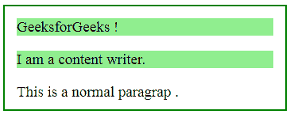

# jQuery | has()带示例

> 原文:[https://www.geeksforgeeks.org/jquery-has-with-examples/](https://www.geeksforgeeks.org/jquery-has-with-examples/)

**has()** 是 jQuery 中的一个内置方法，用于查找指定元素列表中的所有元素。

**语法:**

```
$(selector).has(element)
```

**参数:**它接受一个参数表达式或一个元素来匹配元素。
**返回值:**返回与指定选择器匹配的所有元素，选择器中有一个或多个元素。

**jQuery 代码显示 has()方法的工作方式:**

**代码#1:**

## 超文本标记语言

```
<html>

<head>
    <script
    src="https://ajax.googleapis.com/ajax/libs/jquery/3.3.1/jquery.min.js">
    </script>
    <!-- jQuery code to show the working of this method -->
    <script>
        $(document).ready(function() {
            $("p").has("span").css("background-color", "lightgreen", "bold");
        });
    </script>
    <style>
        body {
            width: 50%;
            height: 100px;
            border: 2px solid green;
            padding: 15px;
            font-size: 19px;
        }
    </style>
</head>

<body>

<p>Geeks <span>for</span> Geeks !</p>

<p>I am a <span>content</span> writer.</p>

<p>This is a normal paragraph .</p>

</body>

</html>
```

**输出:**
所有包含“span”元素的“p”元素都高亮显示。

