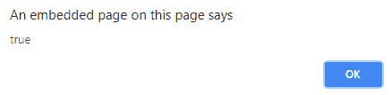

# jQuery | hasClass()带示例

> 原文:[https://www . geesforgeks . org/jquery-has class-with-examples/](https://www.geeksforgeeks.org/jquery-hasclass-with-examples/)

**hasClass()** 是 jQuery 中的一个内置方法，它检查具有指定类名的元素是否存在。
**语法:**

```html
$(selector).hasClass(className);

```

**参数:**它接受一个“类名”参数，该参数指定需要在所选元素中搜索的类名。

**返回值:**如果搜索成功则返回真，否则返回假。
**jQuery 代码展示此方法的工作原理:**

```html
<html>

<head>
    <script 
    src="https://ajax.googleapis.com/ajax/libs/jquery/3.3.1/jquery.min.js">
    </script>
    <script>
        $(document).ready(function() {
            $("button").click(function() {
                alert($("p").hasClass("find"));
            });
        });
    </script>
    <style>
        .find {
            font-size: 120%;
            color: green;
        }

        body {
            width: 50%;
            height: 200px;
            border: 2px solid green;
            padding: 20px;
        }
    </style>
</head>

<body>

    <h1>Heading 1</h1>

    <p class="find">Geeks for Geeks !.</p>
    <p>This is normal paragraph.</p>

    <button>Click me!</button>

</body>

</html>
```

**输出:**
点击“点击我！”
按钮-

点击“点击我！”按钮-
