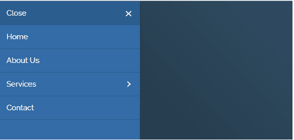

# jQuery hc-offcanvas-nav 插件

> 哎哎哎::1230【https://www . geeksforgeeks . org/jquery-HC-offcanvas-nav 插件/

在本文中，我们将了解 jQuery **hc-offcanvas-nav** 插件，该插件帮助 web 开发人员创建带有灵活的多级菜单和子菜单项的切换式 offcanvas 导航。这个插件提供了一些控制画布外的方法，并且是免费的。

下载 jQuery[**HC-off canvas-nav**](https://github.com/somewebmedia/hc-offcanvas-nav)插件，将需要的预编译文件保存到你的工作文件夹中，并通过添加到你的 HTML 代码的头部来使用它们，如下例所示。

**实例化插件:**

```html
 var Nav = $('#navID').hcOffcanvasNav();
```

**示例 1:** 在以下示例中，在 HTML 容器中创建了一个简单的网页。HTML“ul”和“li”标签用于列出带有参考链接的不同网页。开发人员可以根据应用程序需求更改代码并使其更加嵌套。在代码的 JavaScript 部分， **hc-offcanvas-nav** 插件的初始化是通过一些基本设置完成的。可以添加更多设置并进一步探索。

**示例:**

```html
<!DOCTYPE html>
<html>
<head>
<title>jQuery hc-offcanvas-nav Plugin</title>
    <meta name="viewport" 
     content="width=device-width,
              initial-scale=1.0, 
      maximum-scale=1.0,
      user-scalable=no">

    <link rel="stylesheet" 
          href=
"https://fonts.googleapis.com/icon?family=Material+Icons">
    <link rel="stylesheet" 
          href=
"https://fonts.googleapis.com/css?family=Raleway:200, 300, 400, 600, 700">
    <link rel="stylesheet" href="demo.css">

    <script src=
"https://code.jquery.com/jquery-3.4.1.slim.min.js">
    </script>
    <script src= 
"https://cdnjs.cloudflare.com/ajax/libs/knockout/3.5.0/knockout-min.js">
    </script>
    <script src="hc-offcanvas-nav.js">
    </script>
</head>
<body>
<h2>GFG HC canvas Nav API</h2>
 <div id="container">

      <nav id="navID">
        <ul>
            <li><a href="#">Home</a></li>
        <li><a href="#">About Us</a></li>
        <li><a href="#">Services</a>
         <ul>
            <li><a href="#">Search Engine Optimization</a></li>
        <li><a href="#">Web development</a>
            <ul>
              <li><a href="#">Web design</a></li>
              <li><a href="#">Web content coding</a></li>
            </ul>
        </li>
          </ul>
        </li>
        <li><a href="#">Contact</a></li>
        </ul>
      </nav>

      <script>
        (function($) {
          var Nav;                   
         // initialize hc-offcanvas-nav()
          Nav = $('#navID').hcOffcanvasNav({           
          levelTitles: true,
          closeOnClick: false,
       disableAt: false,            
          });
     // close event
      Nav.close();
        })(jQuery);
      </script>
    </div>
</body>
</html>
```

**输出显示菜单:**

**输出显示子菜单:**

**输出显示导航:**


**示例 2:** 以下示例演示了附加到 HTML 元素的各种数据属性的使用。根据数据属性的使用情况，“关于我们”页面似乎是活动的等等。为了更好的理解，请参考下面给出的输出图像。

```html
<!DOCTYPE html>
<html>
  <head>
    <meta name="viewport" 
     content="width=device-width, initial-scale=1.0,
     maximum-scale=1.0, user-scalable=no">

    <link rel="stylesheet"
          href=
"https://fonts.googleapis.com/icon?family=Material+Icons">
    <link rel="stylesheet"
          href=
"https://fonts.googleapis.com/css?family=Raleway:200, 300, 400, 600, 700">
    <link rel="stylesheet" href="demo.css">

    <script src=
"https://code.jquery.com/jquery-3.4.1.slim.min.js">
    </script>
    <script 
      src=
"https://cdnjs.cloudflare.com/ajax/libs/knockout/3.5.0/knockout-min.js">
    </script>
    <script src="hc-offcanvas-nav.js">
    </script>
  </head>

  <body>
      <nav id="navID">
        <ul>
            <li data-nav-highlight>
            <a href="#">Home</a></li>
        <li data-nav-active><a href="#">About Us</a>
         <ul data-nav-active>
           <li><a href="#">Projects</a></li>
               <li><a href="#">Services</a></li>
         </ul>
       </li>            
       <li><a href="#">Contact</a></li>
       <li><a data-nav-close="false" href="#">
           Add New Page
       </a></li>
       <li data-nav-custom-content>
            <p>Developers or designer's 
own custom content.</p>
       </li>
        </ul>
      </nav>
        <script>
        (function($) {
          var Nav;                   
          // initialize hc-offcanvas-nav()
          Nav = $('#navID').hcOffcanvasNav({           
          levelTitles: true                   
          });

        })(jQuery);
       </script>  
  </body>
</html>
```

**输出显示主菜单:**

**输出显示活动子菜单:**

**输出显示导航:**
